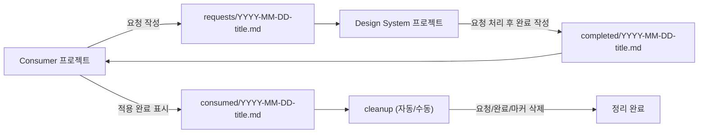

## Claude 개발 자동화 가이드 — 상세 레퍼런스 (Hooks · DS Bridge Watcher · Skills)

이 문서는 `src/claude-automation-guide.ko.md`의 **상세 레퍼런스 파트**를 분리한 파일입니다.  
셋업/운영 관점의 “짧은 본문”은 `src/claude-automation-guide.ko.md`를 기준으로 보고, 아래 내용은 필요할 때만 참고합니다.

---

## 전체 구성(3축)

### 1) Hooks (이벤트 기반 자동화)

- 위치(전역): `~/.claude/settings.json`, `~/.claude/hooks/`
- 역할: Claude Code 내부 이벤트(프롬프트 제출, 서브에이전트 시작, 태스크 완료 등) 발생 시 자동으로 스크립트를 실행

### 2) DS Bridge (파일 기반 협업 프로토콜) + Watcher (tmux 알림)

- 위치(전역): `~/.claude/ds-bridge/`
- 역할: Consumer가 요청 파일을 쓰면 DS가 처리하고 완료 파일로 응답하는 **협업 계약(Contract)**, 그리고 이를 tmux로 자동 “poke”하는 감시자(watcher)

### 3) Skills (SOP 플레이북)

- 위치(레포): `<repo>/.claude/skills/*/SKILL.md`
- 역할: “새 컴포넌트 만들기, 스토리 작성, 피그마 스펙 저장, 시각 테스트, 완료 전 체크리스트” 등을 **반복 가능한 절차**로 고정

---

## DS Bridge 프로토콜 (requests → completed → consumed → cleanup)

### 디렉토리 의미

- `~/.claude/ds-bridge/requests/`: Consumer → DS 변경 요청
- `~/.claude/ds-bridge/completed/`: DS → Consumer 완료 통지
- `~/.claude/ds-bridge/consumed/`: Consumer가 적용 완료를 표시하는 마커

### 파일명 규칙(매우 중요)

- 완료 파일(`completed/*.md`)의 파일명은 **요청 파일(`requests/*.md`)과 반드시 동일**해야 합니다.
- 그래야 “소비됨(consumed) 마커”를 기준으로 세 파일을 한 번에 정리(cleanup)할 수 있습니다.

### 요청(Request) 파일 템플릿(권장)

Consumer가 `requests/`에 작성하는 변경 요청은 다음 템플릿을 권장합니다.

```md
# Change Request

- **from**: consumer-project-name
- **priority**: high | medium | low
- **type**: feature | bugfix | enhancement

## What I Need

- (원하는 변경을 2~5줄로 요약)

## Context

- 어떤 화면/컴포넌트에 변경이 필요한지
- 기존 구현/기술적 제약(가능하면 코드 스니펫/파일명)

## Current Workaround

- 지금은 어떻게 임시로 해결 중인지(있다면)
```

권장 작성 팁:

- “왜 필요한가”가 핵심입니다. DS 변경이 필요한 이유가 명확하면 구현 결정이 빠릅니다.
- 우선순위가 높은 요청은 **blocked file**(전환/적용이 진행되지 않는 파일)을 명시하면 효과가 큽니다.

### 완료(Completion) 파일 템플릿(권장)

DS가 `completed/`에 작성하는 완료 통지는 Consumer가 바로 적용할 수 있도록 “마이그레이션 절차”가 있어야 합니다.

```md
# Completed: {brief title}

- **version**: 0.2.XX
- **request**: {original request filename}

## What Changed

- (핵심 변경 2~5줄)

## New/Changed Props

| Prop | Component | Type | Default | Description |
| ---- | --------- | ---- | ------- | ----------- |

## Migration Steps for Consumer

1. npm install ...
2. 코드 변경 예시(가능하면 짧게)

## Breaking Changes

- None (또는 상세)
```

### 흐름(시각화)



---

## DS Bridge Watcher (tmux 기반 자동 알림)

### 목적

DS Bridge는 “파일 프로토콜”만으로도 동작하지만, 사람이 계속 폴더를 확인해야 합니다. Watcher는 이를 자동화하여:

- 새 요청이 생기면 **DS 세션에 자동 메시지 입력**
- 새 완료가 생기면 **Consumer 세션에 자동 메시지 입력**
- 한 번 알림한 항목은 추적 파일로 관리해 **중복 알림을 최소화**

### 구성 파일

- `~/.claude/ds-bridge/watcher.sh`: 60초 폴링 + tmux send-keys로 poke
- `~/.claude/ds-bridge/check-requests.sh`: DS 프로젝트에서 “요청 있는지” 간단 체크(쿨다운 60초)
- `~/.claude/ds-bridge/check-completions.sh`: Consumer 프로젝트에서 “완료 있는지” 간단 체크(쿨다운 60초)
- `~/.claude/ds-bridge/cleanup-bridge.sh`: consumed 마커를 기준으로 관련 파일을 정리

### 사용 방법(권장)

1. tmux에서 DS 세션과 Consumer 세션을 각각 실행
2. 별도 창/세션에서 watcher 실행

```bash
bash ~/.claude/ds-bridge/watcher.sh
```

### 팁(알림이 과하지 않게)

- watcher는 기본이 60초 폴링입니다. 너무 잦거나 느리면 `POLL_INTERVAL` 환경변수로 조정 가능합니다.
- 같은 요청을 반복 알림하지 않도록 `.notified-requests`, `.notified-completions`를 사용합니다.
  - “새로 watcher를 켜면” 추적 파일이 초기화되므로 처음에 한 번은 알림이 다시 올 수 있습니다(의도된 동작).

### 동작 원리(핵심 포인트)

- watcher는 기본 60초마다 다음을 확인합니다.
  - `requests/*.md` 중 `completed`에 동일 파일명이 없는 항목 → DS에 알림
  - `completed/*.md` 중 `consumed`에 동일 파일명이 없는 항목 → Consumer에 알림
- tmux pane ID는 환경변수로 지정할 수도 있고, 특정 프로젝트 경로가 포함된 pane를 기준으로 **자동 탐지**할 수도 있습니다.
- watcher는 시작 시 `.notified-requests`, `.notified-completions`를 초기화하여 “이번 실행 세션 기준”으로 알림 상태를 관리합니다.

### 트러블슈팅(Watcher)

- **알림이 오지 않는다**
  - tmux pane 탐지가 실패했을 수 있습니다. `DS_PANE`, `CONSUMER_PANE`을 환경변수로 지정하는 방식이 가장 확실합니다.
  - watcher는 “tmux가 실행 중”이어야 동작합니다.
- **알림이 너무 자주 온다**
  - 폴링 주기를 늘립니다(`POLL_INTERVAL`).
  - `.notified-*` 파일이 지워지는 상황(새 실행/정리 스크립트/수동 삭제)이 있는지 확인합니다.
- **파일은 정리되지 않는다**
  - cleanup은 `consumed/` 마커가 있어야 동작합니다. Consumer가 적용 후 “동일 파일명의 마커”를 만들었는지 확인합니다.

---

## Claude Hooks (Claude Code 이벤트 기반 자동화)

### 설정(어디에 무엇을 두는가)

- 전역 설정: `~/.claude/settings.json`
- 전역 훅 스크립트: `~/.claude/hooks/`
- (레포 측면) 추가 권한/옵션: `<repo>/.claude/settings.local.json`

실제로 “자동으로 돌아가는지”는 `~/.claude/settings.json`의 `hooks` 연결 여부로 결정됩니다.

#### 실행 권한

```bash
chmod +x ~/.claude/hooks/plan_review_inject.sh
chmod +x ~/.claude/hooks/team/*.sh
```

#### `settings.json` 최소 예시(형태)

키/개인 설정은 생략하고, hooks 동작에 필요한 형태만 보여줍니다. 기존 설정이 있다면 `hooks`/`teammateMode`만 병합합니다.

```json
{
  "env": { "CLAUDE_CODE_EXPERIMENTAL_AGENT_TEAMS": "1" },
  "teammateMode": "tmux",
  "hooks": {
    "UserPromptSubmit": [
      { "matcher": "", "hooks": [{ "type": "command", "command": "bash ~/.claude/hooks/plan_review_inject.sh" }] }
    ],
    "SubagentStart": [
      { "matcher": "", "hooks": [{ "type": "command", "command": "bash ~/.claude/hooks/team/inject_context.sh", "timeout": 5000 }] }
    ],
    "TeammateIdle": [
      {
        "matcher": "",
        "hooks": [
          { "type": "command", "command": "bash ~/.claude/hooks/team/log_event.sh", "async": true },
          { "type": "command", "command": "bash ~/.claude/hooks/team/teammate_idle_check.sh", "timeout": 10000 }
        ]
      }
    ],
    "TaskCompleted": [
      {
        "matcher": "",
        "hooks": [
          { "type": "command", "command": "bash ~/.claude/hooks/team/log_event.sh", "async": true },
          { "type": "command", "command": "bash ~/.claude/hooks/team/quality_gate.sh", "timeout": 90000 }
        ]
      }
    ],
    "PreToolUse": [
      { "matcher": "Task", "hooks": [{ "type": "command", "command": "bash ~/.claude/hooks/team/log_event.sh", "async": true }] },
      { "matcher": "SendMessage", "hooks": [{ "type": "command", "command": "bash ~/.claude/hooks/team/log_event.sh", "async": true }] },
      { "matcher": "TeamCreate", "hooks": [{ "type": "command", "command": "bash ~/.claude/hooks/team/log_event.sh", "async": true }] }
    ],
    "PostToolUse": [
      { "matcher": "TeamCreate", "hooks": [{ "type": "command", "command": "bash ~/.claude/hooks/team/log_event.sh", "async": true }] }
    ]
  }
}
```

설정 포인트(핵심만):

- `matcher`: 특정 도구/이벤트만 골라 실행할 때 사용합니다(예: `PreToolUse`에서 `Task`만 로깅).
- `timeout`: 지정 시간 내 미완료면 훅 실행을 중단합니다(무한 대기 방지).
- `async`: 로깅 같은 훅은 비동기로 실행해 작업 흐름을 막지 않습니다.

#### (중요) DS 루트 경로 매칭(DS 전용 규칙/게이트)

DS 전용 규칙 주입/품질 게이트는 훅 스크립트 내부의 `DS_ROOT` 매칭에 따라 켜집니다.

- `~/.claude/hooks/team/inject_context.sh`의 `DS_ROOT="<PATH_TO_DS_REPO>"`
- `~/.claude/hooks/team/quality_gate.sh`의 `DS_ROOT="<PATH_TO_DS_REPO>"`

맞지 않으면 “훅은 도는데 DS 전용 로직만 꺼져 있는 상태”가 될 수 있습니다.

---

### 동작(언제 무엇이 자동으로 실행되는가)

훅은 Claude Code가 이벤트를 발생시키면 자동으로 실행됩니다. 별도로 훅 스크립트를 “수동 실행”하는 흐름이 아닙니다.

| 이벤트 | 언제 트리거되나 | 실행 스크립트 | 차단(중단) 가능? | 조건(대표) |
| --- | --- | --- | --- | --- |
| `UserPromptSubmit` | 프롬프트 제출 순간 | `plan_review_inject.sh` | 보통 없음 | `permission_mode=plan`일 때만 템플릿 출력 |
| `SubagentStart` | 서브에이전트 시작 시 | `team/inject_context.sh` | 보통 없음 | `team_name`이 있어야 주입(에이전트 팀 작업에만) |
| `TeammateIdle` | 팀원이 idle로 들어가기 직전 | `team/log_event.sh` + `team/teammate_idle_check.sh` | 있음(Exit 2) | 남은 작업 있으면 idle 방지 |
| `TaskCompleted` | 태스크 완료 시 | `team/log_event.sh` + `team/quality_gate.sh` | 있음(Exit 2) | DS_ROOT 하위에서만 typecheck/lint gate |
| `PreToolUse`/`PostToolUse` | 도구 실행 전/후 | `team/log_event.sh` | 없음(항상 Exit 0) | matcher로 특정 도구만 로깅 |

#### exit code 규칙(중요)

- `exit 0`: 훅이 작업 흐름을 **통과**시킵니다.
- `exit 2`: 훅이 “아직 끝나면 안 된다”고 판단하여 **차단/중단**합니다.
  - 예: `quality_gate.sh`는 typecheck/lint 실패 시 `exit 2`로 완료를 막습니다.
  - 예: `teammate_idle_check.sh`는 남은 태스크가 있으면 `exit 2`로 idle을 막습니다.
- `log_event.sh`는 관측/로깅 목적이므로 **항상 통과**하도록 설계되어야 합니다(일반적으로 `exit 0`).

---

### 검증(“자동으로 돌아감” 확인)

1) 에이전트 팀 작업을 조금 실행합니다(TeamCreate/Task/메시지 전송 등).  
2) 로그가 생성/증가하는지 확인합니다.

- 로그 파일: `~/.claude/logs/team-events.jsonl`
- 통계 보기: `bash ~/.claude/hooks/team/stats.sh`

---

### 트러블슈팅(Hooks)

- **훅이 전혀 실행되지 않는 것 같다**
  - `~/.claude/settings.json`의 `hooks` 섹션이 로드되는지 확인합니다.
  - 훅 스크립트에 실행 권한(+x)이 있는지 확인합니다.
- **훅은 도는 것 같은데 DS 규칙 주입/품질 게이트가 안 걸린다**
  - `DS_ROOT` 매칭이 맞는지 확인합니다(`inject_context.sh`, `quality_gate.sh`).
  - 레포 위치가 바뀌면 이 조건이 깨질 수 있으니, 셋업 시점에 먼저 맞추는 것이 안전합니다.

---

## Repo Skills (SOP: 반복 업무 표준화)

### 위치

- `<repo>/.claude/skills/` 하위에 목적별 `SKILL.md`가 존재

### 현재 레포에 있는 스킬과 역할

- `design-system-rules`: DS 유틸리티 클래스/금지 규칙/검증(타입체크+린트) 기준
- `component-checklist`: “완료 보고 전에 반드시 확인할 항목” 체크리스트
- `new-component`: 신규 컴포넌트 생성 템플릿(폴더/파일 구조, 기본 스토리)
- `storybook-story` / `story`: 스토리북 작성 규칙(controls 정책, argTypes 한글 설명, Default만 controls 활성화 등)
- `figma-save`: Figma 노드 스펙을 저장(`source/`)하는 절차(REST 스크립트 기반)
- `visual-test`: Playwright 시각 회귀 테스트 실행/판정/리포트 절차

효과:

- “누가 해도 같은 방식으로” 새 컴포넌트/스토리/스펙 저장/테스트가 진행됨
- 규칙 위반(예: Tailwind 기본 클래스 사용, controls 정책 누락) 같은 반복 실수를 줄임

### Skills를 운영에 잘 녹이는 방법

- 에이전트 팀에서 “작업 완료의 정의”를 스킬로 고정합니다.
  - 예: 컴포넌트 작업은 `component-checklist`를 통과해야 “완료”
- 반복 작업은 스킬 문서를 “복붙 가능한 체크리스트”로 쓰면, 사람이 바뀌어도 품질이 유지됩니다.

---

## CodeRabbit (참고) — PR 품질 게이트와 자동 머지의 위치

이 문서의 CodeRabbit “단일 진실”은 상단의 `빠른 설정 가이드 → 5) CodeRabbit 포함 PR 루프(최대 3회)` 섹션입니다.  
아래는 중복 설명 대신, “이게 어디에 끼어드는가?”만 짧게 정리합니다.

### 기본 제공 구성(레포에 포함된 훅/워처/스킬만 사용)

- CodeRabbit은 **GitHub PR 워크플로우에서 자동으로 실행**되는 외부 품질 게이트입니다.
- 결과 확인/판단은 PR UI(또는 `gh`)를 통해 수행합니다.
- 즉, “코멘트 수집/요약/수정/재리뷰 트리거/자동 머지”까지가 자동으로 이어지려면 **추가 구성(개인 확장)** 이 필요할 수 있습니다.

### 개인 확장 구성(추가 스킬/훅/스크립트로 구축된 자동화 포함)

- 브랜치 push를 트리거로 PR 생성/연결 → CodeRabbit 코멘트 감지/반영 → `@CodeRabbit review` 재리뷰 요청을 **최대 3회** 루프로 수행
- 모든 필수 체크가 Green이면 auto-merge까지 연결(브랜치 보호 정책 전제)

### 최소 체크리스트(요약)

- **루프 제한**: 최대 3회(무한 반복 방지)
- **중단 조건**: 충돌/빌드 실패/코멘트 해석 애매 → 중단 후 사람이 판단
- **머지 조건**: 필수 체크 Green + (필요 시) 승인 충족일 때만 auto-merge

---

## 사용한 방법

### “항상 돌아가는 2세션 + watcher 1개”

- DS 세션과 Consumer 세션을 tmux로 켜두고, watcher를 돌려 두면
  - 요청/완료가 생기는 순간 자동으로 알림이 가서 “컨텍스트 스위칭 비용”이 크게 줄어듭니다.

### 에이전트 팀 작업은 “규칙 주입 + 품질 게이트 + 로그”가 핵심

- 서브에이전트가 늘어날수록 실수가 누적되기 쉽기 때문에
  - 컨텍스트 주입(inject)
  - 완료 검증(gate)
  - 작업 지속성(idle check)
  - 이벤트 관측(log)
    네 가지가 워크플로 안정성을 좌우합니다.

---

## 기대 효과(정리)

- **개발 커뮤니케이션 비용 감소**: “누가 봤냐/누가 전달했냐” 대신 “파일 + 워처”로 자동 추적
- **품질/일관성 증가**: 스킬(SOP) + 훅(규칙 주입/게이트)로 실수를 구조적으로 감소
- **디버깅 가능**: 에이전트 팀 이벤트 로그로 문제 재현/원인 파악이 쉬움
- **DS↔Consumer 동기화 안정화**: 변경 요청이 표준 포맷으로 기록되고, 완료/적용 상태까지 추적 가능
- **장시간 저개입(무인) 실행 가능**: watcher가 요청/완료를 감지해 세션을 깨우고, 훅이 계획/품질 게이트를 걸며, 에이전트 팀 idle 방지로 작업이 중간에 멈추는 상황을 줄입니다. CodeRabbit 루프/자동 머지까지 연결하면 “수정→재리뷰→머지”가 연속적으로 진행되어 사람이 주기적으로 개입하지 않아도 긴 시간 동안 안정적으로 굴릴 수 있습니다.

---
