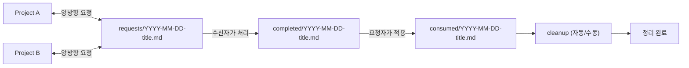

## Claude 개발 자동화 가이드 — 상세 레퍼런스 (Hooks · Bridge Watcher · Skills)

이 문서는 `src/claude-automation-guide.ko.md`의 **상세 레퍼런스 파트**를 분리한 파일입니다.
셋업/운영 관점의 “짧은 본문”은 `src/claude-automation-guide.ko.md`를 기준으로 보고, 아래 내용은 필요할 때만 참고합니다.

> **용어**: 이 문서에서 “Project A”와 “Project B”는 편의상 구분이며, Bridge는 **양방향을 지원**합니다 — 어느 쪽이든 요청을 만들고 응답을 받을 수 있습니다. 일반적으로 Project A = 라이브러리/백엔드, Project B = 앱/프론트엔드입니다. 예시로는 BlumnAi-design-system(= Project A)과 Happytalk-front(= Project B)을 사용합니다.

---

## 전체 구성(3축)

### 1) Hooks (이벤트 기반 자동화)

- 위치(전역): `~/.claude/settings.json`, `~/.claude/hooks/`
- 역할: Claude Code 내부 이벤트(프롬프트 제출, 서브에이전트 시작, 태스크 완료 등) 발생 시 자동으로 스크립트를 실행

### 2) Bridge (파일 기반 협업 프로토콜) + Watcher (tmux 알림)

- 위치(전역): `~/.claude/ds-bridge/`
- 역할: 어느 프로젝트든 요청 파일을 쓰면 상대가 처리하고 완료 파일로 응답하는 **양방향 협업 계약(Contract)**, 그리고 이를 tmux로 양쪽 세션에 자동 “poke”하는 감시자(watcher)

### 3) Skills (SOP 플레이북)

- 위치(레포): `<repo>/.claude/skills/*/SKILL.md`
- 역할: “새 컴포넌트 만들기, 스토리 작성, 피그마 스펙 저장, 시각 테스트, 완료 전 체크리스트” 등을 **반복 가능한 절차**로 고정

---

## Bridge 프로토콜 (requests → completed → consumed → cleanup)

### 디렉토리 의미

- `~/.claude/ds-bridge/requests/`: 양방향 변경 요청 (어느 프로젝트든 작성 가능, `to`/`from` 필드로 수신자/발신자 구분)
- `~/.claude/ds-bridge/completed/`: 양방향 완료 통지 (요청을 처리한 쪽이 작성)
- `~/.claude/ds-bridge/consumed/`: 요청자가 적용 완료를 표시하는 마커

### 파일명 규칙(매우 중요)

- 완료 파일(`completed/*.md`)의 파일명은 **요청 파일(`requests/*.md`)과 반드시 동일**해야 합니다.
- 그래야 “소비됨(consumed) 마커”를 기준으로 세 파일을 한 번에 정리(cleanup)할 수 있습니다.

### 요청(Request) 파일 템플릿

어느 프로젝트든 `requests/`에 작성하는 변경 요청에 사용하는 템플릿입니다.

```md
# Change Request

- **to**: target-project-name
- **from**: sender-project-name
- **priority**: high | medium | low
- **type**: feature | bugfix | enhancement | question

## What I Need

- (원하는 변경을 2~5줄로 요약)

## Context

- 어떤 화면/컴포넌트에 변경이 필요한지
- 기존 구현/기술적 제약(가능하면 코드 스니펫/파일명)

## Current Workaround

- 지금은 어떻게 임시로 해결 중인지(있다면)
```

작성 시 느낀 점:

- “왜 필요한가”가 핵심이었습니다. 상대 프로젝트 변경이 필요한 이유가 명확할수록 구현 결정이 빨랐습니다.
- 우선순위가 높은 요청에는 **blocked file**(전환/적용이 진행되지 않는 파일)을 명시했더니 효과가 컸습니다.
- `type: question`은 요청이 불분명할 때 상대에게 질문하는 용도입니다. 이 경우 “completion”은 답변이 됩니다.

### 완료(Completion) 파일 템플릿

요청을 처리한 쪽이 `completed/`에 작성하는 완료 통지입니다. 요청자가 바로 적용할 수 있도록 “마이그레이션 절차”를 포함시켰습니다.

```md
# Completed: {brief title}

- **version**: 0.2.XX
- **request**: {original request filename}

## What Changed

- (핵심 변경 2~5줄)

## New/Changed Props

| Prop | Component | Type | Default | Description |
| ---- | --------- | ---- | ------- | ----------- |

## Migration Steps

1. npm install ...
2. 코드 변경 예시(가능하면 짧게)

## Breaking Changes

- None (또는 상세)

## Answer (type: question인 경우에만)

- (질문에 대한 답변)
```

### 흐름(시각화)



---

## Bridge Watcher (tmux 기반 자동 알림)

### 목적

Bridge는 “파일 프로토콜”만으로도 동작하지만, 사람이 계속 폴더를 확인해야 합니다. Watcher는 이를 자동화하여:

- 새 요청이 생기면 **양쪽 세션에 자동 메시지 입력** (각 세션이 `to` 필드를 확인해 자기 것만 처리)
- 새 완료가 생기면 **양쪽 세션에 자동 메시지 입력**
- 한 번 알림한 항목은 추적 파일로 관리해 **중복 알림을 최소화**
- 같은 pane 중복 알림 방지: `DS_PANE == CONSUMER_PANE`이면 한 번만 poke

### 구성 파일

- `~/.claude/ds-bridge/watcher.sh`: 60초 폴링 + tmux send-keys로 poke
- `~/.claude/ds-bridge/register.sh`: 현재 tmux 팬을 Project A(`ds`) 또는 Project B(`consumer`)로 등록/해제 + 상태 확인
- `~/.claude/ds-bridge/check-requests.sh`: 양쪽 프로젝트에서 “요청 있는지” 간단 체크(쿨다운 60초)
- `~/.claude/ds-bridge/check-completions.sh`: 양쪽 프로젝트에서 “완료 있는지” 간단 체크(쿨다운 60초)
- `~/.claude/ds-bridge/cleanup-bridge.sh`: consumed 마커를 기준으로 관련 파일을 정리

### 사용 방법

1. tmux에서 Project A 세션과 Project B 세션을 각각 실행
2. **pane 등록** (최초 1회, 세션 재시작 시 재등록):
   - 구현하는 쪽(Project A) 세션 팬에서: `bash ~/.claude/ds-bridge/register.sh ds`
   - 요청하는 쪽(Project B) 세션 팬에서: `bash ~/.claude/ds-bridge/register.sh consumer`
3. 별도 창/세션에서 watcher 실행: `bash ~/.claude/ds-bridge/watcher.sh`
4. 작업 종료 시 등록 해제: `bash ~/.claude/ds-bridge/register.sh unregister all`

등록 상태 확인: `bash ~/.claude/ds-bridge/register.sh status`

등록 파일(`.ds-pane`, `.consumer-pane`)은 `plan_review_inject.sh` 훅의 Bridge 감지 신호로도 사용됩니다 — 등록이 있으면 Plan 모드에서 Bridge 인터럽트/복귀 규칙이 자동 주입되고, 해제하면 주입되지 않습니다.

### Pane 식별 방식

Watcher는 다음 우선순위로 tmux pane을 식별합니다:

1. **등록 파일 우선**: `.ds-pane`, `.consumer-pane` 파일에 저장된 pane ID를 먼저 사용
2. **유효성 검증**: 매 폴링마다 pane의 tmux 세션 존재 여부 + 경로 패턴 일치 여부를 확인
3. **자동 탐지 폴백**: 등록 파일이 없을 때, `node` 프로세스 기반으로 후보가 **정확히 1개**일 때만 자동 선택
4. **모호한 경우 거부**: 같은 프로젝트 경로에 여러 `node` 프로세스(팀원 세션 등)가 있으면 자동 탐지를 거부하고 수동 등록을 요구

### 팁(알림이 과하지 않게)

- watcher는 기본이 60초 폴링입니다. 너무 잦거나 느리면 `POLL_INTERVAL` 환경변수로 조정 가능합니다.
- 같은 요청을 반복 알림하지 않도록 `.notified-requests`, `.notified-completions`를 사용합니다.
  - “새로 watcher를 켜면” 추적 파일이 초기화되므로 처음에 한 번은 알림이 다시 올 수 있습니다(의도된 동작).

### 동작 원리(핵심 포인트)

- watcher는 기본 60초마다 다음을 확인합니다.
  - `requests/*.md` 중 `completed`에 동일 파일명이 없는 항목 → **양쪽 세션에 알림** (각 세션이 `to` 필드 확인)
  - `completed/*.md` 중 `consumed`에 동일 파일명이 없는 항목 → **양쪽 세션에 알림**
  - 같은 pane 중복 방지: `DS_PANE != CONSUMER_PANE`일 때만 두 번째 poke 실행
- tmux pane ID는 등록 파일(`.ds-pane`, `.consumer-pane`)로 관리합니다. 등록이 없으면 자동 탐지를 시도하되, 후보가 여러 개이면 거부합니다.
- watcher는 시작 시 `.notified-requests`, `.notified-completions`를 초기화하여 “이번 실행 세션 기준”으로 알림 상태를 관리합니다.

### 트러블슈팅(Watcher)

- **알림이 오지 않는다**
  - pane 등록이 올바른지 확인합니다: `cat ~/.claude/ds-bridge/.ds-pane` / `cat ~/.claude/ds-bridge/.consumer-pane`
  - 팀원 세션이 여러 개이면 자동 탐지가 실패합니다 → `register.sh`로 수동 등록하세요.
  - watcher는 “tmux가 실행 중”이어야 동작합니다.
- **알림이 너무 자주 온다**
  - 폴링 주기를 늘립니다(`POLL_INTERVAL`).
  - `.notified-*` 파일이 지워지는 상황(새 실행/정리 스크립트/수동 삭제)이 있는지 확인합니다.
- **파일은 정리되지 않는다**
  - cleanup은 `consumed/` 마커가 있어야 동작합니다. 요청자가 적용 후 “동일 파일명의 마커”를 만들었는지 확인합니다.
- **양방향 알림이 안 온다**
  - 양쪽 pane이 모두 등록되어 있는지 확인합니다: `bash ~/.claude/ds-bridge/register.sh status`
  - watcher가 양쪽 poke 로직을 실행하는지 로그를 확인합니다.

---

## Claude Hooks (Claude Code 이벤트 기반 자동화)

### 설정(어디에 무엇을 두는가)

- 전역 설정: `~/.claude/settings.json`
- 전역 훅 스크립트: `~/.claude/hooks/`
- (레포 측면) 추가 권한/옵션: `<repo>/.claude/settings.local.json`

실제로 “자동으로 돌아가는지”는 `~/.claude/settings.json`의 `hooks` 연결 여부로 결정됩니다.

#### 실행 권한

```bash
chmod +x ~/.claude/hooks/plan_review_inject.sh
chmod +x ~/.claude/hooks/team/*.sh
```

#### `settings.json` 최소 예시(형태)

키/개인 설정은 생략하고, hooks 동작에 필요한 형태만 보여줍니다. 기존 설정이 있다면 `hooks`/`teammateMode`만 병합합니다.

```json
{
  "env": { "CLAUDE_CODE_EXPERIMENTAL_AGENT_TEAMS": "1" },
  "teammateMode": "tmux",
  "hooks": {
    "UserPromptSubmit": [
      { "matcher": "", "hooks": [{ "type": "command", "command": "bash ~/.claude/hooks/plan_review_inject.sh" }] }
    ],
    "SubagentStart": [
      { "matcher": "", "hooks": [{ "type": "command", "command": "bash ~/.claude/hooks/team/inject_context.sh", "timeout": 5000 }] }
    ],
    "TeammateIdle": [
      {
        "matcher": "",
        "hooks": [
          { "type": "command", "command": "bash ~/.claude/hooks/team/log_event.sh", "async": true },
          { "type": "command", "command": "bash ~/.claude/hooks/team/teammate_idle_check.sh", "timeout": 10000 }
        ]
      }
    ],
    "TaskCompleted": [
      {
        "matcher": "",
        "hooks": [
          { "type": "command", "command": "bash ~/.claude/hooks/team/log_event.sh", "async": true },
          { "type": "command", "command": "bash ~/.claude/hooks/team/quality_gate.sh", "timeout": 90000 },
          { "type": "command", "command": "bash ~/.claude/hooks/team/coderabbit_review_trigger.sh", "timeout": 10000 }
        ]
      }
    ],
    "PreToolUse": [
      { "matcher": "Task", "hooks": [{ "type": "command", "command": "bash ~/.claude/hooks/team/log_event.sh", "async": true }] },
      { "matcher": "SendMessage", "hooks": [{ "type": "command", "command": "bash ~/.claude/hooks/team/log_event.sh", "async": true }] },
      { "matcher": "TeamCreate", "hooks": [{ "type": "command", "command": "bash ~/.claude/hooks/team/log_event.sh", "async": true }] }
    ],
    "PostToolUse": [
      { "matcher": "TeamCreate", "hooks": [{ "type": "command", "command": "bash ~/.claude/hooks/team/log_event.sh", "async": true }] }
    ],
    "Stop": [
      { "matcher": "", "hooks": [{ "type": "command", "command": "bash ~/.claude/hooks/coderabbit_stop_trigger.sh", "timeout": 15000 }] }
    ]
  }
}
```

설정 포인트(핵심만):

- `matcher`: 특정 도구/이벤트만 골라 실행할 때 사용합니다(예: `PreToolUse`에서 `Task`만 로깅).
- `timeout`: 지정 시간 내 미완료면 훅 실행을 중단합니다(무한 대기 방지).
- `async`: 로깅 같은 훅은 비동기로 실행해 작업 흐름을 막지 않습니다.

#### (중요) 프로젝트 루트 경로 매칭(프로젝트 전용 규칙/게이트)

프로젝트 전용 규칙 주입/품질 게이트는 훅 스크립트 내부의 `case “$CWD”` 패턴 매칭에 따라 켜집니다.

- `~/.claude/hooks/team/inject_context.sh`의 `case “$CWD” in */<your-project-name>*)`
- `~/.claude/hooks/team/quality_gate.sh`의 `case “$CWD” in */<your-project-name>*)` + `sed` 루트 추출
- `~/.claude/hooks/team/coderabbit_review_trigger.sh`의 동일한 패턴

글로브 패턴(`*/project-name*`)을 사용하므로, 같은 프로젝트를 여러 경로에 클론해도 훅이 정상 동작합니다. 맞지 않으면 “훅은 도는데 프로젝트 전용 로직만 꺼져 있는 상태”가 될 수 있습니다.

---

### 동작(언제 무엇이 자동으로 실행되는가)

훅은 Claude Code가 이벤트를 발생시키면 자동으로 실행됩니다. 별도로 훅 스크립트를 “수동 실행”하는 흐름이 아닙니다.

| 이벤트 | 언제 트리거되나 | 실행 스크립트 | 차단(중단) 가능? | 조건(대표) |
| --- | --- | --- | --- | --- |
| `UserPromptSubmit` | 프롬프트 제출 순간 | `plan_review_inject.sh` | 보통 없음 | `permission_mode=plan`일 때만: 리뷰 템플릿 출력 + Bridge 등록 파일 존재 시 인터럽트/복귀 규칙 자동 주입 |
| `SubagentStart` | 서브에이전트 시작 시 | `team/inject_context.sh` | 보통 없음 | `team_name`이 있어야 주입(에이전트 팀 작업에만) |
| `TeammateIdle` | 팀원이 idle로 들어가기 직전 | `team/log_event.sh` + `team/teammate_idle_check.sh` | 있음(Exit 2) | 남은 작업 있으면 idle 방지 |
| `TaskCompleted` | 태스크 완료 시 | `team/log_event.sh` + `team/quality_gate.sh` + `team/coderabbit_review_trigger.sh` | 있음(Exit 2) | 프로젝트 루트 하위에서만 typecheck/lint gate → 전체 완료 시 CodeRabbit 트리거 |
| `Stop` | Claude 응답 완료 시 | `coderabbit_stop_trigger.sh` | 있음(`decision: "block"`) | 솔로 모드 + 완료 신호 + 미리뷰 커밋 존재 시 CodeRabbit 트리거 |
| `PreToolUse`/`PostToolUse` | 도구 실행 전/후 | `team/log_event.sh` | 없음(항상 Exit 0) | matcher로 특정 도구만 로깅 |

#### exit code 규칙(중요)

- `exit 0`: 훅이 작업 흐름을 **통과**시킵니다.
- `exit 2`: 훅이 “아직 끝나면 안 된다”고 판단하여 **차단/중단**합니다.
  - 예: `quality_gate.sh`는 typecheck/lint 실패 시 `exit 2`로 완료를 막습니다.
  - 예: `teammate_idle_check.sh`는 남은 태스크가 있으면 `exit 2`로 idle을 막습니다.
- `log_event.sh`는 관측/로깅 목적이므로 **항상 통과**하도록 설계했습니다(항상 `exit 0`).

---

### 검증(“자동으로 돌아감” 확인)

1) 에이전트 팀 작업을 조금 실행합니다(TeamCreate/Task/메시지 전송 등).  
2) 로그가 생성/증가하는지 확인합니다.

- 로그 파일: `~/.claude/logs/team-events.jsonl`
- 통계 보기: `bash ~/.claude/hooks/team/stats.sh`

---

### 트러블슈팅(Hooks)

- **훅이 전혀 실행되지 않는 것 같다**
  - `~/.claude/settings.json`의 `hooks` 섹션이 로드되는지 확인합니다.
  - 훅 스크립트에 실행 권한(+x)이 있는지 확인합니다.
- **훅은 도는 것 같은데 프로젝트 규칙 주입/품질 게이트가 안 걸린다**
  - `case "$CWD"` 패턴이 프로젝트 디렉토리명과 일치하는지 확인합니다(`inject_context.sh`, `quality_gate.sh`, `coderabbit_review_trigger.sh`).
  - 레포 위치가 바뀌면 이 조건이 깨질 수 있으니, 셋업 시점에 먼저 맞추는 것이 안전합니다.

---

## Repo Skills (SOP: 반복 업무 표준화)

### 위치

- `<repo>/.claude/skills/` 하위에 목적별 `SKILL.md`가 존재

### 현재 레포에 있는 스킬과 역할

- `design-system-rules`: DS 유틸리티 클래스/금지 규칙/검증(타입체크+린트) 기준
- `component-checklist`: “완료 보고 전에 반드시 확인할 항목” 체크리스트
- `new-component`: 신규 컴포넌트 생성 템플릿(폴더/파일 구조, 기본 스토리)
- `storybook-story` / `story`: 스토리북 작성 규칙(controls 정책, argTypes 한글 설명, Default만 controls 활성화 등)
- `figma-save`: Figma 노드 스펙을 저장(`source/`)하는 절차(REST 스크립트 기반)
- `visual-test`: Playwright 시각 회귀 테스트 실행/판정/리포트 절차
- `coderabbit-review`: 구현 완료 보고 **전에** 자동 호출 — Push → PR 생성 → CodeRabbit 리뷰 대기(최대 3라운드) → 수정 → 머지

효과:

- “누가 해도 같은 방식으로” 새 컴포넌트/스토리/스펙 저장/테스트가 진행됨
- 규칙 위반(예: Tailwind 기본 클래스 사용, controls 정책 누락) 같은 반복 실수를 줄임

### Skills를 운영에 녹인 방식

- 에이전트 팀에서 “작업 완료의 정의”를 스킬로 고정했습니다.
  - 예: 컴포넌트 작업은 `component-checklist`를 통과해야 “완료”
- 반복 작업은 스킬 문서를 “복붙 가능한 체크리스트”로 썼더니, 사람이 바뀌어도 품질이 유지되었습니다.

---

## CodeRabbit 자동 리뷰 시스템 (상세)

이 섹션은 `src/claude-automation-guide.ko.md`의 “6) CodeRabbit 자동 리뷰 시스템”의 **상세 레퍼런스**입니다.

### 트리거 방식 (이중 Hook + 중복 방지)

두 훅은 **공유 마커 파일**(`/tmp/coderabbit-triggered-{SESSION_ID}`)로 중복을 방지합니다 — 먼저 트리거되는 쪽이 마커를 생성하면, 다른 쪽은 skip합니다.

| 모드 | Hook 이벤트 | 트리거 경로 |
|------|-------------|-------------|
| **팀 작업** | `TaskCompleted` | `coderabbit_review_trigger.sh` → 리더에게만 `[CODERABBIT REVIEW AUTO-TRIGGER]` 주입 → `coderabbit-review` 스킬 자동 호출 |
| **솔로 작업** | `Stop` | `coderabbit_stop_trigger.sh` → `last_assistant_message`에서 완료 신호 감지 → `decision: “block”` + 트리거 메시지 → `coderabbit-review` 스킬 자동 호출 |

### `coderabbit_review_trigger.sh` 동작 흐름 (팀 모드)

1. JSON 입력에서 `cwd`, `session_id`, `team_name` 파싱
2. `cwd`가 대상 프로젝트 패턴(`*/<your-project-name>*`)과 일치하는지 확인
3. `team_name`이 비어있으면 skip (솔로 모드 → `Stop` 훅이 처리)
4. **공유 마커 확인** — 이미 트리거되었으면 skip
5. 팀 config의 `members[0].agentId`와 `session_id` 비교 → 리더가 아니면 skip
6. `~/.claude/tasks/{team_name}/` 안에 `pending`/`in_progress` 태스크가 있으면 skip (개별 태스크 완료 시 트리거 안 됨)
7. `company/main` 대비 미리뷰 커밋이 있고, 변경 파일 중 코드 파일(`.md`/`.txt`/`.mdx` 제외)이 1개 이상인지 확인 — 문서만 변경된 분석/리서치 팀은 트리거하지 않음
8. 모든 조건 통과 → **마커 생성** → `[CODERABBIT REVIEW AUTO-TRIGGER]` 메시지 출력

### `coderabbit_stop_trigger.sh` 동작 흐름 (솔로 모드)

1. JSON 입력에서 `cwd`, `session_id`, `team_name`, `stop_hook_active`, `last_assistant_message` 파싱
2. `stop_hook_active=true`이면 skip (무한루프 방지)
3. `cwd`가 대상 프로젝트 패턴과 일치하는지 확인
4. `team_name`이 있으면 skip (팀 모드 → `TaskCompleted` 훅이 처리)
5. **공유 마커 확인** — 이미 트리거되었으면 skip
6. `company/main` 대비 미리뷰 커밋이 있고, 변경 파일 중 코드 파일(`.md`/`.txt`/`.mdx` 제외)이 1개 이상인지 확인 — 문서만 변경된 경우 트리거하지 않음
7. `last_assistant_message`에서 완료 키워드(done, published, pushed 등) 감지 + 질문으로 끝나지 않는지 확인
8. 모든 조건 통과 → **마커 생성** → `{“decision”: “block”, “reason”: “[CODERABBIT REVIEW AUTO-TRIGGER]...”}` 출력

### `coderabbit-review` 스킬 4단계

| Phase | 내용 | 핵심 명령 |
|-------|------|-----------|
| **1. Pre-flight** | dirty tree, 브랜치 확인, typecheck/lint | `git status`, `npm run typecheck && npm run lint` |
| **2. Push + PR** | 리모트 push, PR 생성/재사용 | `git push origin HEAD`, `gh pr create --repo ...` |
| **3. Review loop** | 최대 3라운드 리뷰 수정 | `gh api .../reviews`, `@coderabbitai review` |
| **4. Merge + sync** | squash merge → main 동기화 | `gh pr merge --squash`, `git pull origin main` |

### 안전장치

- **중복 방지**: 공유 마커 파일(`/tmp/coderabbit-triggered-{SESSION_ID}`)로 세션당 1회만 트리거
- **무한루프 방지**: `Stop` 훅은 `stop_hook_active` 플래그 체크 — block 후 재실행 시 자동 통과
- **반복 제한**: 최대 3라운드 (critical 이슈 시 4라운드까지 연장 가능)
- **force push 금지**: 항상 일반 `git push`
- **구체적 파일 스테이징**: `git add <specific-files>` — `git add -A` 사용 금지
- **머지 후 main 동기화**: squash merge 후 로컬 main을 최신 상태로 유지
- **중단 조건**: merge conflict / CI 실패 / 리뷰 해석 모호 / regression 발생 시 자동 중단

---

## 사용한 방법

### “항상 돌아가는 2세션 + watcher 1개”

- Project A 세션과 Project B 세션을 tmux로 켜두고, watcher를 돌려 두면
  - 요청/완료가 생기는 순간 자동으로 알림이 가서 “컨텍스트 스위칭 비용”이 크게 줄어듭니다.

### 에이전트 팀 작업은 “규칙 주입 + 품질 게이트 + 로그”가 핵심

- 서브에이전트가 늘어날수록 실수가 누적되기 쉽기 때문에
  - 컨텍스트 주입(inject)
  - 완료 검증(gate)
  - 작업 지속성(idle check)
  - 이벤트 관측(log)
    네 가지가 워크플로 안정성을 좌우합니다.

---

## 실제 효과(정리)

- **개발 커뮤니케이션 비용 감소**: “누가 봤냐/누가 전달했냐” 대신 “파일 + 워처”로 자동 추적
- **품질/일관성 증가**: 스킬(SOP) + 훅(규칙 주입/게이트)로 실수를 구조적으로 감소
- **디버깅 가능**: 에이전트 팀 이벤트 로그로 문제 재현/원인 파악이 쉬움
- **Project A↔Project B 동기화 안정화**: 변경 요청이 표준 포맷으로 기록되고, 완료/적용 상태까지 추적 가능
- **장시간 저개입(무인) 실행 가능**: watcher가 요청/완료를 감지해 세션을 깨우고, 훅이 계획/품질 게이트를 걸며, 에이전트 팀 idle 방지로 작업이 중간에 멈추는 상황을 줄입니다. CodeRabbit 루프/자동 머지까지 연결하면 “수정→재리뷰→머지”가 연속적으로 진행되어 사람이 주기적으로 개입하지 않아도 긴 시간 동안 안정적으로 굴릴 수 있습니다.

---
