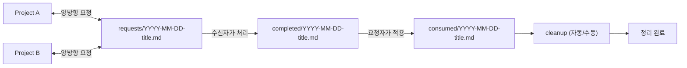

## Claude 개발 자동화 구현 가이드 (Hooks · Bridge Watcher · Skills · CodeRabbit)

배경/효과는 `src/claude-automation-summary.ko.md`를 먼저 읽은 뒤 이 가이드를 참고하세요.

---

## 1. 용어 정리 + 전제 조건

### 용어

- **Project A / Project B**: 편의상 구분하지만, Bridge는 **양방향**입니다 — 어느 쪽이든 요청을 만들고 응답을 받을 수 있습니다.
  - 일반적으로 Project A = 공통 패키지/라이브러리/백엔드, Project B = 앱/프론트엔드/소비자 프로젝트
  - Bridge 흐름: `requests/`에 변경 요청 작성(`to`/`from` 필수) → 상대가 처리 후 `completed/` 작성 → 요청자가 적용 완료 시 `consumed/` 마커 생성
- 이 문서에서는 **BlumnAi-design-system(= Project A)** 과 **Happytalk-front(= Project B)** 를 예시로 사용합니다.

### 전제 조건

이 구성에서 사용한 도구/환경:

- **tmux**: 에이전트 팀/워처가 세션을 깨우는 방식이 tmux 기반
- **Python 3** (`/usr/bin/python3`): 훅 스크립트가 JSON 파싱에 사용. 시스템에 경로가 다르면 각 스크립트에서 수정 필요
- **GitHub CLI(`gh`)**: PR 생성/코멘트/상태 확인 자동화에 사용
  - 인증 상태 확인: `gh auth status`
- **CodeRabbit**: GitHub App으로 설치 필요 (https://github.com/apps/coderabbitai). 자동 리뷰 기능 사용 시 필수
- **레포 설정**: 자동 머지를 쓰려면 브랜치 보호(필수 체크/필수 승인)와 Auto-merge 허용이 되어 있어야 함
- **`settings.json`에서 에이전트 팀 활성화**: `"CLAUDE_CODE_EXPERIMENTAL_AGENT_TEAMS": "1"` + `"teammateMode": "tmux"` 설정 필요 (4-3절 참고)

### 플레이스홀더 규칙

이 가이드 전체에서 두 가지 플레이스홀더 패턴을 사용합니다:

- **`<your-project-a>`, `<your-project-b>`**: Bridge/Watcher 스크립트에서 **두 프로젝트를 구분**할 때 사용. 예: `blumnai-design-system`, `happytalk-front`
- **`<your-project-name>`**: 훅 스크립트에서 **해당 훅이 반응할 프로젝트**를 지정할 때 사용. 두 프로젝트 모두에 적용하려면 `case` 문에 패턴을 추가: `*/<project-a>*|*/<project-b>*)`

모두 프로젝트 **디렉토리명**입니다 (경로의 마지막 폴더명).

### 빠른 설정 순서 (Quick Start)

1. Bridge 디렉토리 생성 (2-1절)
2. Bridge 스크립트 생성 (2-5절): `check-requests.sh`, `check-completions.sh`, `cleanup-bridge.sh`, `register.sh`, `watcher.sh`
3. `~/.claude/settings.json` 구성 (4-3절): 훅 이벤트 연결 + 에이전트 팀 활성화
4. 훅 스크립트 생성 (4-7절): `inject_context.sh`, `quality_gate.sh`, `teammate_idle_check.sh`, `log_event.sh`, `plan_review_inject.sh`, `coderabbit_review_trigger.sh`, `coderabbit_stop_trigger.sh`, `cleanup_tmux_panes.sh`
5. 프로젝트 레벨 훅 설정 (4-10절): `stop-gate.sh`, `inject-rules.sh` + `settings.local.json` 훅 등록
6. 스킬 생성 (5절): `<repo>/.claude/skills/*/SKILL.md`
7. Pane 등록 (3-1절): 각 Claude 세션에서 `register.sh a`/`b` 실행
8. Watcher 실행 (3-2절): 별도 tmux pane에서 `watcher.sh` 실행

### 훅 입력 프로토콜

모든 훅 스크립트는 **stdin으로 JSON 객체**를 받습니다 (`INPUT=$(cat)`). Claude Code가 이벤트 발생 시 자동으로 전달합니다.

주요 필드:

| 필드 | 설명 | 제공 이벤트 |
|------|------|-------------|
| `cwd` | 현재 작업 디렉토리 | 모든 이벤트 |
| `session_id` | 세션 고유 ID | 모든 이벤트 |
| `team_name` | 팀 이름 (팀 모드일 때만) | 팀 이벤트 |
| `agent_name` | 에이전트 이름 | `TeammateIdle` |
| `hook_event_name` | 이벤트 유형 | 모든 이벤트 |
| `permission_mode` | 현재 권한 모드 | `UserPromptSubmit` |
| `last_assistant_message` | 마지막 어시스턴트 메시지 | `Stop` |
| `stop_hook_active` | Stop 훅 실행 중 여부 | `Stop` |

---

## 2. Bridge 디렉토리 + 프로토콜

### 2-1) 디렉토리 준비

아래 디렉토리가 있어야 합니다(없으면 생성).

- `~/.claude/ds-bridge/requests/`
- `~/.claude/ds-bridge/completed/`
- `~/.claude/ds-bridge/consumed/`

```bash
mkdir -p ~/.claude/ds-bridge/{requests,completed,consumed}
```

### 2-2) 디렉토리 의미

- `~/.claude/ds-bridge/requests/`: 양방향 변경 요청 (어느 프로젝트든 작성 가능, `to`/`from` 필드로 수신자/발신자 구분)
- `~/.claude/ds-bridge/completed/`: 양방향 완료 통지 (요청을 처리한 쪽이 작성)
- `~/.claude/ds-bridge/consumed/`: 요청자가 적용 완료를 표시하는 마커

### 2-3) 동작 방식

파일 기반 프로토콜: 같은 파일명이 `requests/ → completed/ → consumed/`로 흐르면서 요청/완료/적용 상태가 자동 매칭됩니다. Watcher가 다음 poll 주기에 `consumed/` 마커를 기준으로 세 파일을 한 번에 정리합니다 (수동: `cleanup-bridge.sh`).

Claude가 Bridge를 자동으로 사용하는 구조:
- `inject_context.sh`(4절)가 서브에이전트 시작 시 Bridge 경로/규칙/템플릿을 자동 주입
- `check-requests.sh` / `check-completions.sh`가 양쪽 프로젝트에서 주기적 체크
- watcher가 양쪽 세션을 poke

요청/완료 파일은 마크다운이며 핵심 필드:
- **요청 파일** (`requests/*.md`): `to`, `from`, `priority`, `type`(feature/bugfix/enhancement/question), 변경 내용
- **완료 파일** (`completed/*.md`): 버전, 변경 내역, 마이그레이션 절차, breaking changes

### 2-4) 흐름



### 2-5) Bridge 스크립트

`~/.claude/ds-bridge/` 아래 스크립트들이 "2개 프로젝트 동시 운영"을 자동화합니다. (폴더 이름이 `ds-bridge`이지만 역할은 일반적인 Project A↔Project B 브리지입니다.)

> **`a` / `b` pane 라벨**: 스크립트에서 쓰이는 `a`와 `b`는 **watcher가 tmux pane을 식별하기 위한 라벨**입니다.
> - `a` = 첫 번째 프로젝트 세션의 pane
> - `b` = 두 번째 프로젝트 세션의 pane
>
> Bridge는 **양방향**입니다 — 어느 쪽이든 `requests/`에 요청을 만들 수 있고, 상대가 `completed/`로 응답합니다.
> watcher는 새 요청/완료가 생기면 **양쪽 pane 모두에 알림**을 보내고, 각 세션은 `to` 필드를 확인해 자신에게 해당하는 항목만 처리합니다.

- **`watcher.sh`**: `requests/`/`completed/` 변화를 감지해 tmux로 **두 세션을 poke**
  - 주요 설정: `PANE_A`, `PANE_B`, `POLL_INTERVAL`
  - **pane 식별**: 등록 파일(`.a-pane`, `.b-pane`) 우선 → 자동 탐지는 후보가 1개일 때만
  - 여러 `node` 프로세스가 같은 프로젝트 경로에 있으면(팀원 세션 등) 자동 탐지를 거부하고 수동 등록을 요구
- **`register.sh`**: 현재 tmux 팬에서 실행하여 해당 팬의 Bridge 역할을 등록/해제
  - `bash ~/.claude/ds-bridge/register.sh a` — 첫 번째 프로젝트 팬 등록
  - `bash ~/.claude/ds-bridge/register.sh b` — 두 번째 프로젝트 팬 등록
  - `bash ~/.claude/ds-bridge/register.sh unregister a|b|all` — 등록 해제
  - `bash ~/.claude/ds-bridge/register.sh status` — 현재 등록 상태 확인
  - 등록 파일이 존재하면 `plan_review_inject.sh`가 Plan 모드에서 Bridge 인터럽트/복귀 규칙을 자동 주입
- **`check-requests.sh`**: 미처리 요청 확인 (수동 실행 또는 hook으로 연결 가능, 쿨다운 포함)
- **`check-completions.sh`**: 새 완료 확인 (수동 실행 또는 hook으로 연결 가능, 쿨다운 포함)
- **`cleanup-bridge.sh`**: `consumed/` 마커 기준으로 관련 파일 정리 (수동 실행용 — 자동 정리는 Watcher가 처리)

#### `~/.claude/ds-bridge/check-requests.sh`

```bash
#!/bin/bash
# Check for pending Bridge requests — both projects (60s 쿨다운)

case "$PWD" in
  */<your-project-a>*|*/<your-project-b>*) ;;
  *) exit 0 ;;
esac

LOCK="$HOME/.claude/ds-bridge/.last-request-check"
NOW=$(date +%s)

if [ -f "$LOCK" ]; then
  LAST=$(cat "$LOCK")
  DIFF=$((NOW - LAST))
  [ "$DIFF" -lt 60 ] && exit 0
fi

echo "$NOW" > "$LOCK"

REQUESTS_DIR="$HOME/.claude/ds-bridge/requests"
COMPLETED_DIR="$HOME/.claude/ds-bridge/completed"

if [ ! -d "$REQUESTS_DIR" ]; then
  echo "✅ DS Bridge requests: nothing new"
  exit 0
fi

pending=""
for req in "$REQUESTS_DIR"/*.md; do
  [ -f "$req" ] || continue
  basename=$(basename "$req")
  if [ ! -f "$COMPLETED_DIR/$basename" ]; then
    pending="$pending\n  - $basename"
  fi
done

if [ -n "$pending" ]; then
  echo "⚠️ DS Bridge: Pending request(s):$pending"
  echo "Read the request files in ~/.claude/ds-bridge/requests/ — check the to: field and process if addressed to you."
else
  echo "✅ DS Bridge requests: nothing new"
fi
```

#### `~/.claude/ds-bridge/check-completions.sh`

```bash
#!/bin/bash
# Check for Bridge completion notices — both projects (60s 쿨다운)

case "$PWD" in
  */<your-project-a>*|*/<your-project-b>*) ;;
  *) exit 0 ;;
esac

LOCK="$HOME/.claude/ds-bridge/.last-completion-check"
NOW=$(date +%s)

if [ -f "$LOCK" ]; then
  LAST=$(cat "$LOCK")
  DIFF=$((NOW - LAST))
  [ "$DIFF" -lt 60 ] && exit 0
fi

echo "$NOW" > "$LOCK"

COMPLETED_DIR="$HOME/.claude/ds-bridge/completed"
CONSUMED_DIR="$HOME/.claude/ds-bridge/consumed"

mkdir -p "$CONSUMED_DIR"

if [ ! -d "$COMPLETED_DIR" ]; then
  echo "✅ DS Bridge completions: nothing new"
  exit 0
fi

pending=""
for comp in "$COMPLETED_DIR"/*.md; do
  [ -f "$comp" ] || continue
  basename=$(basename "$comp")
  if [ ! -f "$CONSUMED_DIR/$basename" ]; then
    pending="$pending\n  - $basename"
  fi
done

if [ -n "$pending" ]; then
  echo "⚠️ DS Bridge: New completion(s) available:$pending"
  echo "Read the completion files in ~/.claude/ds-bridge/completed/ — check and apply if addressed to you."
  echo "After applying, touch the matching file in ~/.claude/ds-bridge/consumed/ to mark it done."
else
  echo "✅ DS Bridge completions: nothing new"
fi
```

#### `~/.claude/ds-bridge/cleanup-bridge.sh`

```bash
#!/bin/bash
# Auto-delete bridge files once consumed (full cycle complete)
# Runs on both projects — only cleans files with consumed markers

BRIDGE_DIR="$HOME/.claude/ds-bridge"
REQUESTS_DIR="$BRIDGE_DIR/requests"
COMPLETED_DIR="$BRIDGE_DIR/completed"
CONSUMED_DIR="$BRIDGE_DIR/consumed"

[ -d "$CONSUMED_DIR" ] || exit 0

cleaned=0
for marker in "$CONSUMED_DIR"/*.md; do
  [ -f "$marker" ] || continue
  basename=$(basename "$marker")

  [ -f "$REQUESTS_DIR/$basename" ] && rm "$REQUESTS_DIR/$basename"
  [ -f "$COMPLETED_DIR/$basename" ] && rm "$COMPLETED_DIR/$basename"
  rm "$marker"
  echo "🧹 DS Bridge: Cleaned up $basename"
  cleaned=$((cleaned + 1))
done

if [ "$cleaned" -eq 0 ]; then
  echo "🔄 DS Bridge cleanup: nothing to clean"
fi
```

---

## 3. Bridge Watcher 구성

### 3-1) pane 등록 (최초 1회, 세션 재시작 시 재등록)

각 프로젝트의 Claude 세션에서 **Claude에게 직접 요청**하여 등록합니다:

```text
(프로젝트 A의 Claude 세션에서)
> bash ~/.claude/ds-bridge/register.sh a 를 실행해줘

(프로젝트 B의 Claude 세션에서)
> bash ~/.claude/ds-bridge/register.sh b 를 실행해줘
```

`a`/`b`는 watcher가 pane을 식별하는 라벨입니다. 양쪽 모두 요청/응답이 가능합니다.

등록하면 `~/.claude/ds-bridge/.a-pane`과 `.b-pane` 파일에 팬 ID가 저장됩니다.
watcher는 매 폴링 때 이 파일을 읽고, 팬이 유효한지(tmux 세션 존재 + 경로 일치) 검증합니다.
유효하지 않으면 자동으로 등록을 제거하고 재등록을 안내합니다.

> **주의: 반드시 각 Claude 세션에서 실행해야 합니다.**
> `register.sh`는 `$TMUX_PANE` 환경변수로 현재 프로세스가 실행 중인 pane을 식별합니다.
> 사용자가 터미널에서 직접 실행하면 `tmux display-message`가 **현재 attached된 세션**을 반환하므로,
> 다른 tmux 세션에서 실행해도 동일한 pane ID가 등록되는 문제가 발생합니다.
> 반드시 **해당 프로젝트의 Claude 세션 안에서** 실행을 요청하세요.

> **주의: 오래된 tmux 세션 정리.**
> 같은 프로젝트 경로를 가진 tmux 세션이 여러 개 있으면 watcher의 자동 탐지가 혼란을 겪습니다.
> 사용하지 않는 이전 세션은 `tmux kill-session -t <세션번호>`로 정리하세요.
> `tmux list-panes -a -F '#{session_name}:#{window_index}.#{pane_index}  #{pane_current_path}'`로 현재 상태를 확인할 수 있습니다.

등록 파일(`.a-pane`, `.b-pane`)은 `plan_review_inject.sh` 훅의 Bridge 감지 신호로도 사용됩니다 — 등록이 있으면 Plan 모드에서 Bridge 인터럽트/복귀 규칙이 자동 주입되고, 해제하면 주입되지 않습니다.

### 3-2) watcher 실행

```bash
bash ~/.claude/ds-bridge/watcher.sh
```

작업 종료 시 등록 해제: `bash ~/.claude/ds-bridge/register.sh unregister all`

등록 상태 확인: `bash ~/.claude/ds-bridge/register.sh status`

### 3-3) Pane 식별 방식

Watcher는 다음 우선순위로 tmux pane을 식별합니다:

1. **등록 파일 우선**: `.a-pane`, `.b-pane` 파일에 저장된 pane ID를 먼저 사용
2. **유효성 검증**: 매 폴링마다 pane의 tmux 세션 존재 여부 + 경로 패턴 일치 여부를 확인
3. **자동 탐지 폴백**: 등록 파일이 없을 때, `node` 프로세스 기반으로 후보가 **정확히 1개**일 때만 자동 선택
4. **모호한 경우 거부**: 같은 프로젝트 경로에 여러 `node` 프로세스(팀원 세션 등)가 있으면 자동 탐지를 거부하고 수동 등록을 요구

### 3-4) 동작 원리

- watcher는 기본 60초마다 다음을 확인합니다.
  - `requests/*.md` 중 `completed`에 동일 파일명이 없는 항목 → **양쪽 세션에 알림** (각 세션이 `to` 필드 확인)
  - `completed/*.md` 중 `consumed`에 동일 파일명이 없는 항목 → **양쪽 세션에 알림**
  - 같은 pane 중복 방지: `PANE_A != PANE_B`일 때만 두 번째 poke 실행
- tmux pane ID는 등록 파일(`.a-pane`, `.b-pane`)로 관리합니다. 등록이 없으면 자동 탐지를 시도하되, 후보가 여러 개이면 거부합니다.
- watcher는 시작 시 `.notified-requests`, `.notified-completions`를 초기화하여 "이번 실행 세션 기준"으로 알림 상태를 관리합니다.

### 3-5) 팁(알림이 과하지 않게)

- watcher는 기본이 60초 폴링입니다. 너무 잦거나 느리면 `POLL_INTERVAL` 환경변수로 조정 가능합니다.
- 같은 요청을 반복 알림하지 않도록 `.notified-requests`, `.notified-completions`를 사용합니다.
  - "새로 watcher를 켜면" 추적 파일이 초기화되므로 처음에 한 번은 알림이 다시 올 수 있습니다(의도된 동작).

### 3-6) `register.sh`

```bash
#!/bin/bash
# Register/unregister tmux panes for Bridge watcher
#
# Register (각 Claude 세션에서 실행):
#   bash ~/.claude/ds-bridge/register.sh a
#   bash ~/.claude/ds-bridge/register.sh b
#
# Unregister:
#   bash ~/.claude/ds-bridge/register.sh unregister a
#   bash ~/.claude/ds-bridge/register.sh unregister b
#   bash ~/.claude/ds-bridge/register.sh unregister all
#
# Status:
#   bash ~/.claude/ds-bridge/register.sh status

BRIDGE_DIR="$HOME/.claude/ds-bridge"

# ── Unregister ────────────────────────────────────────────────
if [ "$1" = "unregister" ]; then
  TARGET="$2"
  case "$TARGET" in
    a)
      if [ -f "$BRIDGE_DIR/.a-pane" ]; then
        rm -f "$BRIDGE_DIR/.a-pane"
        echo "✅ Unregistered pane A"
      else
        echo "ℹ️  Pane A was not registered"
      fi
      ;;
    b)
      if [ -f "$BRIDGE_DIR/.b-pane" ]; then
        rm -f "$BRIDGE_DIR/.b-pane"
        echo "✅ Unregistered pane B"
      else
        echo "ℹ️  Pane B was not registered"
      fi
      ;;
    all)
      rm -f "$BRIDGE_DIR/.a-pane" "$BRIDGE_DIR/.b-pane"
      echo "✅ Unregistered all panes"
      ;;
    *)
      echo "Usage: register.sh unregister <a|b|all>"
      exit 1
      ;;
  esac
  exit 0
fi

# ── Status ────────────────────────────────────────────────────
if [ "$1" = "status" ]; then
  echo "Bridge registration status:"
  if [ -f "$BRIDGE_DIR/.a-pane" ]; then
    echo "  a: $(cat "$BRIDGE_DIR/.a-pane")"
  else
    echo "  a: (not registered)"
  fi
  if [ -f "$BRIDGE_DIR/.b-pane" ]; then
    echo "  b: $(cat "$BRIDGE_DIR/.b-pane")"
  else
    echo "  b: (not registered)"
  fi
  exit 0
fi

# ── Register ──────────────────────────────────────────────────
ROLE="$1"

if [ -z "$ROLE" ] || [[ "$ROLE" != "a" && "$ROLE" != "b" ]]; then
  echo "Usage: register.sh <a|b>"
  echo "       register.sh unregister <a|b|all>"
  echo "       register.sh status"
  echo ""
  echo "  a   Register this pane as the Project A session"
  echo "  b   Register this pane as the Project B session"
  exit 1
fi

# $TMUX_PANE: 프로세스별 환경변수 — attached 세션이 아닌 실제 실행 pane을 식별
if [ -z "$TMUX_PANE" ]; then
  echo "❌ Not in a tmux session"
  exit 1
fi

PANE_ID=$(tmux display-message -t "$TMUX_PANE" -p '#{session_name}:#{window_index}.#{pane_index}' 2>/dev/null)
PANE_PATH=$(tmux display-message -t "$TMUX_PANE" -p '#{pane_current_path}' 2>/dev/null)

if [ -z "$PANE_ID" ]; then
  echo "❌ Could not resolve tmux pane from \$TMUX_PANE=$TMUX_PANE"
  exit 1
fi

echo "$PANE_ID" > "$BRIDGE_DIR/.${ROLE}-pane"
echo "✅ Registered pane $ROLE: $PANE_ID ($PANE_PATH)"
```

### 3-7) `watcher.sh` (전체)

```bash
#!/bin/bash
# Bridge Watcher — polls every 60s, pokes Claude sessions when action needed
#
# Usage:  bash ~/.claude/ds-bridge/watcher.sh
# Stop:   Ctrl+C
#
# Pane registration (run from the correct tmux pane):
#   bash ~/.claude/ds-bridge/register.sh a
#   bash ~/.claude/ds-bridge/register.sh b

# ── Configuration ──────────────────────────────────────────────
PANE_A="${PANE_A:-}"
PANE_B="${PANE_B:-}"
POLL_INTERVAL="${POLL_INTERVAL:-60}"
# <your-project-a>, <your-project-b>를 실제 프로젝트 디렉토리명으로 변경
PATTERN_A="${PATTERN_A:-<your-project-a>}"
PATTERN_B="${PATTERN_B:-<your-project-b>}"

BRIDGE_DIR="$HOME/.claude/ds-bridge"
REQUESTS_DIR="$BRIDGE_DIR/requests"
COMPLETED_DIR="$BRIDGE_DIR/completed"
CONSUMED_DIR="$BRIDGE_DIR/consumed"
NOTIFIED_REQUESTS="$BRIDGE_DIR/.notified-requests"
NOTIFIED_COMPLETIONS="$BRIDGE_DIR/.notified-completions"

# ── Helpers ────────────────────────────────────────────────────
log() {
  echo "$(date '+%H:%M:%S') $1"
}

is_notified() {
  local tracking_file="$1"
  local name="$2"
  [ -f "$tracking_file" ] && grep -qxF "$name" "$tracking_file"
}

mark_notified() {
  local tracking_file="$1"
  local name="$2"
  echo "$name" >> "$tracking_file"
}

unmark_notified() {
  local tracking_file="$1"
  local name="$2"
  [ -f "$tracking_file" ] && grep -vxF "$name" "$tracking_file" > "${tracking_file}.tmp" && mv "${tracking_file}.tmp" "$tracking_file"
}

# ── Pane validation ───────────────────────────────────────────
# Check: tmux session exists + pane path contains expected pattern
validate_pane() {
  local pane="$1"
  local path_pattern="$2"

  tmux has-session -t "${pane%%:*}" 2>/dev/null || return 1

  local pane_path
  pane_path=$(tmux display-message -t "$pane" -p '#{pane_current_path}' 2>/dev/null)
  [[ "$pane_path" == *"$path_pattern"* ]]
}

# ── Pane detection ────────────────────────────────────────────
# Priority: 1) registration files  2) auto-detect (only when unambiguous)
detect_panes() {
  # --- Validate currently held panes ---
  if [ -n "$PANE_A" ] && ! validate_pane "$PANE_A" "$PATTERN_A"; then
    log "   ⚠️  Pane A $PANE_A gone — clearing"
    PANE_A=""
  fi
  if [ -n "$PANE_B" ] && ! validate_pane "$PANE_B" "$PATTERN_B"; then
    log "   ⚠️  Pane B $PANE_B gone — clearing"
    PANE_B=""
  fi

  [ -n "$PANE_A" ] && [ -n "$PANE_B" ] && return 0

  # --- 1. Try registration files ---
  if [ -z "$PANE_A" ] && [ -f "$BRIDGE_DIR/.a-pane" ]; then
    local reg
    reg=$(cat "$BRIDGE_DIR/.a-pane" 2>/dev/null | tr -d '[:space:]')
    if [ -n "$reg" ] && validate_pane "$reg" "$PATTERN_A"; then
      PANE_A="$reg"
      log "   Pane A (registered): $PANE_A"
    else
      log "   ⚠️  Registered Pane A ($reg) is stale — removing"
      rm -f "$BRIDGE_DIR/.a-pane"
    fi
  fi

  if [ -z "$PANE_B" ] && [ -f "$BRIDGE_DIR/.b-pane" ]; then
    local reg
    reg=$(cat "$BRIDGE_DIR/.b-pane" 2>/dev/null | tr -d '[:space:]')
    if [ -n "$reg" ] && validate_pane "$reg" "$PATTERN_B"; then
      PANE_B="$reg"
      log "   Pane B (registered): $PANE_B"
    else
      log "   ⚠️  Registered pane B ($reg) is stale — removing"
      rm -f "$BRIDGE_DIR/.b-pane"
    fi
  fi

  # --- 2. Auto-detect fallback (only when exactly 1 candidate) ---
  if [ -z "$PANE_A" ] || [ -z "$PANE_B" ]; then
    local panes
    panes=$(tmux list-panes -a -F '#{session_name}:#{window_index}.#{pane_index}|#{pane_current_path}|#{pane_current_command}' 2>/dev/null)

    if [ -z "$panes" ]; then
      log "   ❌ tmux not running or no panes found"
      return 1
    fi

    local a_candidates=()
    local b_candidates=()

    while IFS='|' read -r pane_id pane_path pane_cmd; do
      if [ "$pane_cmd" = "node" ]; then
        case "$pane_path" in
          */$PATTERN_A*)
            a_candidates+=("$pane_id")
            ;;
          */$PATTERN_B*)
            b_candidates+=("$pane_id")
            ;;
        esac
      fi
    done <<< "$panes"

    if [ -z "$PANE_A" ]; then
      if [ ${#a_candidates[@]} -eq 1 ]; then
        PANE_A="${a_candidates[0]}"
        log "   Pane A (auto): $PANE_A"
      elif [ ${#a_candidates[@]} -gt 1 ]; then
        log "   ⚠️  ${#a_candidates[@]} A panes found: ${a_candidates[*]}"
        log "      → Register the correct one: bash ~/.claude/ds-bridge/register.sh a"
      else
        log "   ⚠️  No A pane found"
      fi
    fi

    if [ -z "$PANE_B" ]; then
      if [ ${#b_candidates[@]} -eq 1 ]; then
        PANE_B="${b_candidates[0]}"
        log "   Pane B (auto): $PANE_B"
      elif [ ${#b_candidates[@]} -gt 1 ]; then
        log "   ⚠️  ${#b_candidates[@]} B panes found: ${b_candidates[*]}"
        log "      → Register the correct one: bash ~/.claude/ds-bridge/register.sh b"
      else
        log "   ⚠️  No B pane found"
      fi
    fi
  fi
}

# ── Request / completion checks ───────────────────────────────

has_new_requests() {
  [ ! -d "$REQUESTS_DIR" ] && return 1
  for req in "$REQUESTS_DIR"/*.md; do
    [ -f "$req" ] || continue
    local base
    base=$(basename "$req")
    [ ! -f "$COMPLETED_DIR/$base" ] && ! is_notified "$NOTIFIED_REQUESTS" "$base" && return 0
  done
  return 1
}

has_new_completions() {
  [ ! -d "$COMPLETED_DIR" ] && return 1
  mkdir -p "$CONSUMED_DIR"
  for comp in "$COMPLETED_DIR"/*.md; do
    [ -f "$comp" ] || continue
    local base
    base=$(basename "$comp")
    [ ! -f "$CONSUMED_DIR/$base" ] && ! is_notified "$NOTIFIED_COMPLETIONS" "$base" && return 0
  done
  return 1
}

list_and_mark_new_requests() {
  for req in "$REQUESTS_DIR"/*.md; do
    [ -f "$req" ] || continue
    local base
    base=$(basename "$req")
    if [ ! -f "$COMPLETED_DIR/$base" ] && ! is_notified "$NOTIFIED_REQUESTS" "$base"; then
      echo "  - $base"
      mark_notified "$NOTIFIED_REQUESTS" "$base"
    fi
  done
}

list_and_mark_new_completions() {
  for comp in "$COMPLETED_DIR"/*.md; do
    [ -f "$comp" ] || continue
    local base
    base=$(basename "$comp")
    if [ ! -f "$CONSUMED_DIR/$base" ] && ! is_notified "$NOTIFIED_COMPLETIONS" "$base"; then
      echo "  - $base"
      mark_notified "$NOTIFIED_COMPLETIONS" "$base"
    fi
  done
}

clean_notified_tracking() {
  if [ -f "$NOTIFIED_REQUESTS" ]; then
    local to_remove=()
    while IFS= read -r name; do
      [ -z "$name" ] && continue
      if [ -f "$COMPLETED_DIR/$name" ] || [ ! -f "$REQUESTS_DIR/$name" ]; then
        to_remove+=("$name")
      fi
    done < "$NOTIFIED_REQUESTS"
    for name in "${to_remove[@]+"${to_remove[@]}"}"; do
      unmark_notified "$NOTIFIED_REQUESTS" "$name"
    done
  fi
  if [ -f "$NOTIFIED_COMPLETIONS" ]; then
    local to_remove=()
    while IFS= read -r name; do
      [ -z "$name" ] && continue
      if [ -f "$CONSUMED_DIR/$name" ] || [ ! -f "$COMPLETED_DIR/$name" ]; then
        to_remove+=("$name")
      fi
    done < "$NOTIFIED_COMPLETIONS"
    for name in "${to_remove[@]+"${to_remove[@]}"}"; do
      unmark_notified "$NOTIFIED_COMPLETIONS" "$name"
    done
  fi
}

# ── Poke a Claude session via tmux ────────────────────────────
poke() {
  local pane="$1"
  local message="$2"

  if [ -z "$pane" ]; then
    log "   ⚠️  No pane configured, skipping"
    return 1
  fi

  if ! tmux has-session -t "${pane%%:*}" 2>/dev/null; then
    log "   ⚠️  Session ${pane%%:*} not found"
    return 1
  fi

  tmux send-keys -t "$pane" -l "$message"
  sleep 0.5
  tmux send-keys -t "$pane" Enter
  log "   ✅ Poked $pane"
  return 0
}

# ── Main Loop ──────────────────────────────────────────────────
echo ""
echo "╔══════════════════════════════════════════╗"
echo "║    Bridge Watcher                        ║"
echo "║    Polling every ${POLL_INTERVAL}s · Ctrl+C to stop    ║"
echo "╚══════════════════════════════════════════╝"
echo ""

detect_panes

rm -f "$NOTIFIED_REQUESTS" "$NOTIFIED_COMPLETIONS"
touch "$NOTIFIED_REQUESTS" "$NOTIFIED_COMPLETIONS"

echo ""
log "👀 Watching..."
echo ""

while true; do
  detect_panes 2>/dev/null

  clean_notified_tracking

  # Requests — poke both panes
  if has_new_requests; then
    log "📨 New Bridge request(s):"
    list_and_mark_new_requests
    poke "$PANE_A" "New items in ~/.claude/ds-bridge/requests/ — check the to: field and process if addressed to you."
    [ "$PANE_A" != "$PANE_B" ] && \
      poke "$PANE_B" "New items in ~/.claude/ds-bridge/requests/ — check the to: field and process if addressed to you."
  fi

  # Completions — poke both panes
  if has_new_completions; then
    log "📦 New Bridge completion(s):"
    list_and_mark_new_completions
    poke "$PANE_A" "New items in ~/.claude/ds-bridge/completed/ — check and apply if addressed to you."
    [ "$PANE_A" != "$PANE_B" ] && \
      poke "$PANE_B" "New items in ~/.claude/ds-bridge/completed/ — check and apply if addressed to you."
  fi

  if [ -d "$CONSUMED_DIR" ]; then
    for marker in "$CONSUMED_DIR"/*.md; do
      [ -f "$marker" ] || continue
      base=$(basename "$marker")
      [ -f "$REQUESTS_DIR/$base" ] && rm "$REQUESTS_DIR/$base"
      [ -f "$COMPLETED_DIR/$base" ] && rm "$COMPLETED_DIR/$base"
      unmark_notified "$NOTIFIED_REQUESTS" "$base"
      unmark_notified "$NOTIFIED_COMPLETIONS" "$base"
      rm "$marker"
      log "🧹 Cleaned up $base"
    done
  fi

  sleep "$POLL_INTERVAL"
done
```

### 3-8) 트러블슈팅(Watcher)

- **알림이 오지 않는다**
  - pane 등록이 올바른지 확인합니다: `cat ~/.claude/ds-bridge/.a-pane` / `cat ~/.claude/ds-bridge/.b-pane`
  - 팀원 세션이 여러 개이면 자동 탐지가 실패합니다 → `register.sh`로 수동 등록하세요.
  - watcher는 "tmux가 실행 중"이어야 동작합니다.
- **알림이 너무 자주 온다**
  - 폴링 주기를 늘립니다(`POLL_INTERVAL`).
  - `.notified-*` 파일이 지워지는 상황(새 실행/정리 스크립트/수동 삭제)이 있는지 확인합니다.
- **파일은 정리되지 않는다**
  - cleanup은 `consumed/` 마커가 있어야 동작합니다. 요청자가 적용 후 "동일 파일명의 마커"를 만들었는지 확인합니다.
- **양방향 알림이 안 온다**
  - 양쪽 pane이 모두 등록되어 있는지 확인합니다: `bash ~/.claude/ds-bridge/register.sh status`
  - watcher가 양쪽 poke 로직을 실행하는지 로그를 확인합니다.

---

## 4. Hooks 설치/활성화

### 4-1) 파일 위치

- 전역 설정: `~/.claude/settings.json`
- 전역 훅 스크립트: `~/.claude/hooks/`
- (레포 측면) 추가 권한/옵션: `<repo>/.claude/settings.local.json`
- 프로젝트 레벨 훅 스크립트: `<repo>/.claude/hooks/` (4-10절 참고)

### 4-2) 훅 스크립트 실행 권한

```bash
chmod +x ~/.claude/hooks/plan_review_inject.sh
chmod +x ~/.claude/hooks/coderabbit_stop_trigger.sh
chmod +x ~/.claude/hooks/team/*.sh

# 프로젝트 레벨 훅 (4-10절)
chmod +x .claude/hooks/stop-gate.sh
chmod +x .claude/hooks/inject-rules.sh
```

### 4-3) `~/.claude/settings.json`에 hooks 연결(예시)

아래는 "동작에 필요한 최소 예시"입니다. 기존 설정이 있다면 **`hooks`/`teammateMode`만 병합**합니다.

```json
{
  "env": {
    "CLAUDE_CODE_EXPERIMENTAL_AGENT_TEAMS": "1"
  },
  "teammateMode": "tmux",
  "hooks": {
    "UserPromptSubmit": [
      {
        "matcher": "",
        "hooks": [
          {
            "type": "command",
            "command": "bash ~/.claude/hooks/plan_review_inject.sh"
          }
        ]
      }
    ],
    "SubagentStart": [
      {
        "matcher": "",
        "hooks": [
          {
            "type": "command",
            "command": "bash ~/.claude/hooks/team/inject_context.sh",
            "timeout": 5000
          }
        ]
      }
    ],
    "TeammateIdle": [
      {
        "matcher": "",
        "hooks": [
          {
            "type": "command",
            "command": "bash ~/.claude/hooks/team/log_event.sh",
            "async": true
          },
          {
            "type": "command",
            "command": "bash ~/.claude/hooks/team/teammate_idle_check.sh",
            "timeout": 10000
          }
        ]
      }
    ],
    "TaskCompleted": [
      {
        "matcher": "",
        "hooks": [
          {
            "type": "command",
            "command": "bash ~/.claude/hooks/team/log_event.sh",
            "async": true
          },
          {
            "type": "command",
            "command": "bash ~/.claude/hooks/team/quality_gate.sh",
            "timeout": 90000
          },
          {
            "type": "command",
            "command": "bash ~/.claude/hooks/team/coderabbit_review_trigger.sh",
            "timeout": 10000
          }
        ]
      }
    ],
    "PreToolUse": [
      {
        "matcher": "Task",
        "hooks": [
          {
            "type": "command",
            "command": "bash ~/.claude/hooks/team/log_event.sh",
            "async": true
          }
        ]
      },
      {
        "matcher": "SendMessage",
        "hooks": [
          {
            "type": "command",
            "command": "bash ~/.claude/hooks/team/log_event.sh",
            "async": true
          }
        ]
      },
      {
        "matcher": "TeamCreate",
        "hooks": [
          {
            "type": "command",
            "command": "bash ~/.claude/hooks/team/log_event.sh",
            "async": true
          }
        ]
      }
    ],
    "PostToolUse": [
      {
        "matcher": "TeamCreate",
        "hooks": [
          {
            "type": "command",
            "command": "bash ~/.claude/hooks/team/log_event.sh",
            "async": true
          }
        ]
      },
      {
        "matcher": "TeamDelete",
        "hooks": [
          {
            "type": "command",
            "command": "bash ~/.claude/hooks/team/cleanup_tmux_panes.sh",
            "timeout": 10000
          }
        ]
      }
    ],
    "Stop": [
      {
        "matcher": "",
        "hooks": [
          {
            "type": "command",
            "command": "bash ~/.claude/hooks/coderabbit_stop_trigger.sh",
            "timeout": 15000
          },
          {
            "type": "command",
            "command": "bash ~/.claude/hooks/team/cleanup_tmux_panes.sh",
            "timeout": 10000
          }
        ]
      }
    ]
  }
}
```

설정 포인트(핵심만):

- `matcher`: 특정 도구/이벤트만 골라 실행할 때 사용합니다(예: `PreToolUse`에서 `Task`만 로깅).
- `timeout`: 지정 시간 내 미완료면 훅 실행을 중단합니다(무한 대기 방지).
- `async`: 로깅 같은 훅은 비동기로 실행해 작업 흐름을 막지 않습니다.

### 4-4) 이벤트 동작 요약

훅은 Claude Code가 이벤트를 발생시키면 자동으로 실행됩니다. 별도로 훅 스크립트를 "수동 실행"하는 흐름이 아닙니다.

| 이벤트 | 언제 트리거되나 | 실행 스크립트 | 차단(중단) 가능? | 조건(대표) |
| --- | --- | --- | --- | --- |
| `UserPromptSubmit` | 프롬프트 제출 순간 | `plan_review_inject.sh` | 보통 없음 | `permission_mode=plan`일 때만: 리뷰 템플릿 출력 + Bridge 등록 파일 존재 시 인터럽트/복귀 규칙 자동 주입 |
| `SubagentStart` | 서브에이전트 시작 시 | `team/inject_context.sh` | 보통 없음 | `team_name`이 있어야 주입(에이전트 팀 작업에만) |
| `TeammateIdle` | 팀원이 idle로 들어가기 직전 | `team/log_event.sh` + `team/teammate_idle_check.sh` | 있음(Exit 2) | 남은 작업 있으면 idle 방지 |
| `TaskCompleted` | 태스크 완료 시 | `team/log_event.sh` + `team/quality_gate.sh` + `team/coderabbit_review_trigger.sh` | 있음(Exit 2) | 프로젝트 루트 하위에서만 typecheck/lint gate → 전체 완료 시 CodeRabbit 트리거 |
| `PreToolUse`/`PostToolUse` | 도구 실행 전/후 | `team/log_event.sh` | 없음(항상 Exit 0) | matcher로 특정 도구만 로깅 |
| `PostToolUse` (`TeamDelete`) | 팀 삭제 시 | `team/cleanup_tmux_panes.sh` | 없음 | 종료된 팀원의 tmux pane 자동 정리 |
| `Stop` | Claude 응답 완료 시 | `coderabbit_stop_trigger.sh` + `team/cleanup_tmux_panes.sh` + `stop-gate.sh`(프로젝트 레벨) | 있음(`decision: "block"`) | CodeRabbit 트리거 + 고아 pane 정리 + 활성 작업 마커 기반 중단 방지 |
| `SessionStart` | 세션 시작 / 컨텍스트 압축 후 | `inject-rules.sh`(프로젝트 레벨) | 없음 | 자율 작업 규칙 주입 + stale 마커 경고 |

### 4-5) exit code 규칙(중요)

- `exit 0`: 훅이 작업 흐름을 **통과**시킵니다.
- `exit 2`: 훅이 "아직 끝나면 안 된다"고 판단하여 **차단/중단**합니다.
  - 예: `quality_gate.sh`는 typecheck/lint 실패 시 `exit 2`로 완료를 막습니다.
  - 예: `teammate_idle_check.sh`는 남은 태스크가 있으면 `exit 2`로 idle을 막습니다.
- `exit 0` + JSON `{"decision": "block"}`: **Stop 훅 전용** — exit 0이면서 이유(reason)를 Claude에게 전달할 수 있습니다. `exit 2`는 차단만 하고 이유를 전달할 수 없으므로, Stop 훅에서는 이 방식을 사용합니다.
  - 예: `stop-gate.sh`는 활성 작업 마커가 있으면 `{"decision": "block", "reason": "..."}`로 차단하며, 작업 내용과 진행 상황을 reason에 포함합니다.
- `log_event.sh`는 관측/로깅 목적이므로 **항상 통과**하도록 설계했습니다(항상 `exit 0`).

### 4-6) 프로젝트 루트 매칭(프로젝트 전용 규칙/게이트)

프로젝트 전용 규칙 주입/품질 게이트는 훅 스크립트 내부의 `case "$CWD"` 패턴 매칭에 따라 켜집니다.

- `~/.claude/hooks/team/inject_context.sh`: `case "$CWD" in */<your-project-name>*)` 패턴으로 대상 프로젝트를 판별
- `~/.claude/hooks/team/quality_gate.sh`: 동일한 `case` 패턴 + `sed` 루트 추출
- `~/.claude/hooks/team/coderabbit_review_trigger.sh`: 동일한 패턴

절대 경로 대신 글로브 패턴(`*/project-name*`)을 사용했기 때문에, 같은 프로젝트를 여러 경로에 클론해도 훅이 정상 동작합니다. 여러 프로젝트에 적용하려면 `case` 문에 패턴을 추가하면 됩니다.

### 4-7) 훅 스크립트

`settings.json`에서 연결한 각 스크립트입니다. 프로젝트 경로는 글로브 패턴(`*/<your-project-name>*`)으로 매칭하며, 프로젝트별 규칙은 `case` 블록 안에 추가합니다.

#### `~/.claude/hooks/plan_review_inject.sh`

```bash
#!/usr/bin/env bash
# UserPromptSubmit hook — injects context based on mode and active systems
# 1. Plan mode: plan review template
# 2. Plan mode + Bridge active: Bridge interrupt/resume rules
set -uo pipefail

INPUT=$(cat)
PERMISSION_MODE=$(echo "$INPUT" | /usr/bin/python3 -c "import sys,json; print(json.load(sys.stdin).get('permission_mode',''))" 2>/dev/null)

# Only inject in plan mode
if [ "$PERMISSION_MODE" != "plan" ]; then
  exit 0
fi

# --- Plan review template ---
PLAN_REVIEW_FILE="$HOME/.claude/commands/plan-review.md"
if [ -f "$PLAN_REVIEW_FILE" ]; then
  echo "[Plan Mode 리뷰 프로세스 - 자동 적용]"
  cat "$PLAN_REVIEW_FILE"
fi

# --- Bridge awareness (only when Bridge is active) ---
BRIDGE_DIR="$HOME/.claude/ds-bridge"

if [ -f "$BRIDGE_DIR/.a-pane" ] || [ -f "$BRIDGE_DIR/.b-pane" ]; then
  cat <<'BRIDGE_CONTEXT'

[DS Bridge Protocol - Active (Bidirectional)]
Two-project Bridge is registered. Both projects can create requests to each other.

## Bridge Interrupt/Resume Rules
- **Required fields**: Every request MUST have `to` and `from` fields to identify sender/receiver.
- **When to create a request**: If implementing the plan requires changes in the OTHER project, create a request file in `~/.claude/ds-bridge/requests/YYYY-MM-DD-<short-title>.md`
- **Clarification requests**: If a received request is unclear, create a `type: question` request back to the sender. The "completion" for a question is the answer.
- **After creating a request**: Do NOT block. Continue with other work that doesn't depend on the requested change.
- **When a completion arrives** (watcher will notify you): Check the `to` field — if addressed to you, pause current work at a safe point → read the completion file in `~/.claude/ds-bridge/completed/` → apply the update → mark consumed by touching the same filename in `~/.claude/ds-bridge/consumed/` → resume previous work.
- **Request file format**: Use the template in the Bridge protocol (to / from / What I Need / Context / Current Workaround).
- **Filename rule**: `completed/` filename MUST match the `requests/` filename exactly.

Include these as explicit steps in your plan phases where cross-project changes are likely.
BRIDGE_CONTEXT
fi

exit 0
```

#### `~/.claude/hooks/team/inject_context.sh`

```bash
#!/usr/bin/env bash
# Injects context into every spawned subagent
# Global: naming conventions (all projects)
# Project-specific: project rules (only within <your-project-name>)

set -uo pipefail

INPUT=$(cat)

PARSED=$(echo "$INPUT" | /usr/bin/python3 -c "
import json, sys
d = json.load(sys.stdin)
print(d.get('team_name', '') + '|' + d.get('cwd', ''))
" 2>/dev/null || echo "|")

TEAM_NAME=$(echo "$PARSED" | cut -d'|' -f1)
CWD=$(echo "$PARSED" | cut -d'|' -f2)

# Skip injection for non-team subagents (Explore, Plan, etc.)
if [ -z "$TEAM_NAME" ]; then
  exit 0
fi

# --- Global context (all projects) ---
cat <<'GLOBAL'

## Agent Naming Convention (MANDATORY)
Use generic sequential names when spawning teammates:
- reviewer-one, reviewer-two, reviewer-three
- implementer-one, implementer-two
- analyst-one, researcher-one, tester-one
NEVER use task-specific names like "button-reviewer", "sidebar-fixer", "auth-implementer".
When your work is complete and no tasks remain, send a message to the team lead requesting shutdown.

GLOBAL

# --- Project-specific context (패턴 매칭으로 프로젝트 판별) ---
case "$CWD" in
  */<your-project-name>*)
    cat <<'PROJECT_RULES'
## Project Rules (ACTIVE PROJECT)
- After ALL code changes: run `npm run typecheck && npm run lint`
# 여기에 프로젝트별 규칙 추가 (타이포그래피, 스페이싱, 컬러 등)
PROJECT_RULES
    ;;
esac

# --- Bridge awareness (for team subagents) ---
BRIDGE_DIR="$HOME/.claude/ds-bridge"
if [ -f "$BRIDGE_DIR/.a-pane" ] || [ -f "$BRIDGE_DIR/.b-pane" ]; then
  cat <<'BRIDGE_RULES'

## Bridge Protocol (ACTIVE — Bidirectional)
Cross-project changes MUST go through the Bridge protocol:
- Create requests in ~/.claude/ds-bridge/requests/ with `to` and `from` fields
- Use `type: question` to ask the other project for clarification
- Do NOT make direct changes in the other project's codebase
- Check ~/.claude/ds-bridge/completed/ for responses addressed to your project
BRIDGE_RULES
fi

exit 0
```

#### `~/.claude/hooks/team/quality_gate.sh`

```bash
#!/usr/bin/env bash
# Quality gate for TaskCompleted events
# Runs typecheck + lint when cwd is within the target project
# Exit 0 = allow, Exit 2 = block with feedback

set -uo pipefail

INPUT=$(cat)

CWD=$(echo "$INPUT" | /usr/bin/python3 -c "
import json, sys
d = json.load(sys.stdin)
print(d.get('cwd', ''))
" 2>/dev/null || echo "")

# Skip gate if not within the target project
case "$CWD" in
  */<your-project-name>*) ;;
  *)
    exit 0
    ;;
esac

# CWD에서 프로젝트 루트를 추출
PROJECT_ROOT=$(echo "$CWD" | sed 's|\(.*<your-project-name>\).*|\1|')

ERRORS=""

# Run typecheck
TC_OUTPUT=$(cd "$PROJECT_ROOT" && npm run typecheck 2>&1) || {
  ERRORS="$(printf 'TYPECHECK FAILED:\n%s' "$(echo "$TC_OUTPUT" | tail -30)")"
}

# Run lint
LINT_OUTPUT=$(cd "$PROJECT_ROOT" && npm run lint 2>&1) || {
  if [ -n "$ERRORS" ]; then
    ERRORS="$(printf '%s\n\n' "$ERRORS")"
  fi
  ERRORS="$(printf '%sLINT FAILED:\n%s' "$ERRORS" "$(echo "$LINT_OUTPUT" | tail -30)")"
}

if [ -n "$ERRORS" ]; then
  printf '%s\n' "$ERRORS" >&2
  exit 2
fi

exit 0
```

#### `~/.claude/hooks/team/teammate_idle_check.sh`

```bash
#!/usr/bin/env bash
# Checks if an idle teammate still has work to do
# Reads task files from ~/.claude/tasks/{team_name}/
# Exit 2 = work remains (keep working), Exit 0 = no work (allow idle/shutdown)

set -uo pipefail

INPUT=$(cat)

# Parse agent_name and team_name in a single Python call
PARSED=$(echo "$INPUT" | /usr/bin/python3 -c "
import json, sys
d = json.load(sys.stdin)
print(d.get('agent_name', '') + '|' + d.get('team_name', ''))
" 2>/dev/null || echo "|")

AGENT_NAME=$(echo "$PARSED" | cut -d'|' -f1)
TEAM_NAME=$(echo "$PARSED" | cut -d'|' -f2)

if [ -z "$TEAM_NAME" ]; then
  exit 0
fi

TASKS_DIR="$HOME/.claude/tasks/$TEAM_NAME"

if [ ! -d "$TASKS_DIR" ]; then
  exit 0
fi

# Pass tasks_dir and agent via env vars — no shell interpolation into Python
RESULT=$(TASKS_DIR="$TASKS_DIR" AGENT="$AGENT_NAME" /usr/bin/python3 -c "
import json, os, glob

tasks_dir = os.environ['TASKS_DIR']
agent = os.environ['AGENT']
my_in_progress = 0
pending_unblocked = 0
pending_tasks = []

for f in glob.glob(os.path.join(tasks_dir, '*.json')):
    try:
        with open(f) as fh:
            t = json.load(fh)
        status = t.get('status', '')
        owner = t.get('owner', '')
        blocked_by = t.get('blockedBy', [])
        subject = t.get('subject', '')

        if status == 'in_progress' and owner == agent:
            my_in_progress += 1
        elif status == 'pending' and len(blocked_by) == 0:
            pending_unblocked += 1
            pending_tasks.append(subject)
    except:
        pass

print(f'{my_in_progress}|{pending_unblocked}|{\";\".join(pending_tasks[:3])}')
" 2>/dev/null || echo "0|0|")

MY_IN_PROGRESS=$(echo "$RESULT" | cut -d'|' -f1)
PENDING_UNBLOCKED=$(echo "$RESULT" | cut -d'|' -f2)
PENDING_SUBJECTS=$(echo "$RESULT" | cut -d'|' -f3)

TOTAL=$((MY_IN_PROGRESS + PENDING_UNBLOCKED))

if [ "$TOTAL" -gt 0 ]; then
  MSG="You still have work to do."
  if [ "$MY_IN_PROGRESS" -gt 0 ]; then
    MSG="$MSG You have $MY_IN_PROGRESS in-progress task(s) assigned to you."
  fi
  if [ "$PENDING_UNBLOCKED" -gt 0 ]; then
    MSG="$MSG There are $PENDING_UNBLOCKED pending unblocked task(s) available: $PENDING_SUBJECTS"
  fi
  MSG="$MSG Check TaskList and continue working. If you believe all your work is truly done, send a message to the team lead requesting shutdown."
  echo "$MSG" >&2
  exit 2
fi

exit 0
```

#### `~/.claude/hooks/team/log_event.sh`

```bash
#!/usr/bin/env bash
# Universal async logger for all team events
# Appends structured JSONL to ~/.claude/logs/team-events.jsonl
# Always exits 0 — never blocks execution

LOG_FILE="$HOME/.claude/logs/team-events.jsonl"
mkdir -p "$(dirname "$LOG_FILE")"

INPUT=$(cat)

# Single Python call — reads JSON from stdin, no shell interpolation
echo "$INPUT" | /usr/bin/python3 -c "
import json, sys, datetime

try:
    d = json.load(sys.stdin)
except:
    sys.exit(0)

entry = {
    'ts': datetime.datetime.now(datetime.timezone.utc).strftime('%Y-%m-%dT%H:%M:%SZ'),
    'event': d.get('hook_event_name', 'unknown'),
    'session': d.get('session_id', 'unknown'),
    'cwd': d.get('cwd', ''),
}

tool_name = d.get('tool_name', '')
if tool_name:
    entry['tool'] = tool_name

agent_name = d.get('agent_name', '')
if agent_name:
    entry['agent'] = agent_name

team_name = d.get('team_name', '')
if team_name:
    entry['team'] = team_name

ti = d.get('tool_input', {})
if isinstance(ti, dict):
    parts = []
    for k in ['description', 'name', 'team_name', 'subject', 'type', 'recipient', 'subagent_type']:
        if k in ti:
            parts.append(f'{k}={ti[k]}')
    summary = '; '.join(parts[:4])
    if summary:
        entry['summary'] = summary

print(json.dumps(entry))
" >> "$LOG_FILE" 2>/dev/null

exit 0
```

#### `~/.claude/hooks/team/stats.sh`

```bash
#!/usr/bin/env bash
# Manual CLI tool to view team event stats
# Usage:
#   bash ~/.claude/hooks/team/stats.sh              # All-time stats
#   bash ~/.claude/hooks/team/stats.sh SESSION_ID   # Stats for one session

set -uo pipefail

LOG_FILE="$HOME/.claude/logs/team-events.jsonl"

if [ ! -f "$LOG_FILE" ]; then
  echo "No log file found at $LOG_FILE"
  echo "Events will appear here after team hooks start firing."
  exit 0
fi

SESSION_FILTER="${1:-}" LOG_FILE="$LOG_FILE" /usr/bin/python3 -c "
import json, sys, os
from collections import Counter, defaultdict

session_filter = os.environ.get('SESSION_FILTER', '')
log_file = os.environ.get('LOG_FILE', '')

events = []
with open(log_file) as f:
    for line in f:
        line = line.strip()
        if not line:
            continue
        try:
            events.append(json.loads(line))
        except:
            pass

if session_filter:
    events = [e for e in events if e.get('session') == session_filter]

if not events:
    if session_filter:
        print(f'No events found for session: {session_filter}')
    else:
        print('No events logged yet.')
    sys.exit(0)

# Counts
event_counts = Counter(e['event'] for e in events)
sessions = set(e.get('session', '') for e in events)
agents = set(e.get('agent', '') for e in events if e.get('agent'))
teams = set(e.get('team', '') for e in events if e.get('team'))

# Timeline
timestamps = sorted(e['ts'] for e in events if 'ts' in e)

print('=' * 60)
if session_filter:
    print(f'  Team Stats — Session: {session_filter[:16]}...')
else:
    print(f'  Team Stats — All Time')
print('=' * 60)
print()

print(f'  Sessions:     {len(sessions)}')
print(f'  Teams:        {len(teams)}')
print(f'  Agents:       {len(agents)}')
print(f'  Total events: {len(events)}')
print()

print('  Event Breakdown:')
for event, count in event_counts.most_common():
    print(f'    {event:30s} {count:>5}')
print()

if agents:
    print('  Agents seen:')
    for a in sorted(agents):
        print(f'    - {a}')
    print()

if teams:
    print('  Teams:')
    for t in sorted(teams):
        print(f'    - {t}')
    print()

if timestamps:
    print(f'  First event: {timestamps[0]}')
    print(f'  Last event:  {timestamps[-1]}')
    print()

print('=' * 60)
"
```

#### `~/.claude/hooks/team/cleanup_tmux_panes.sh`

```bash
#!/usr/bin/env bash
# Cleans up orphaned tmux panes from terminated teammates.
# Runs on lead's Stop hook and PostToolUse(TeamDelete).
# Finds panes where the Claude process has exited
# (showing shell prompt with "Resume this session" text) and kills them.

set -uo pipefail

# Only run if tmux is available and we're in a tmux session
if ! command -v tmux &>/dev/null; then
  exit 0
fi

# Get current pane and session
CURRENT_PANE=$(tmux display-message -p '#{pane_id}' 2>/dev/null || echo "")
if [ -z "$CURRENT_PANE" ]; then
  exit 0
fi

CURRENT_SESSION=$(tmux display-message -p '#{session_name}' 2>/dev/null || echo "")
if [ -z "$CURRENT_SESSION" ]; then
  exit 0
fi

# Find panes in the CURRENT SESSION only (-s, not -a which scans all sessions)
# where the command is zsh/bash (meaning the Claude process exited and dropped back to shell)
tmux list-panes -s -t "$CURRENT_SESSION" -F '#{pane_id} #{pane_current_command}' 2>/dev/null | while read -r PANE_ID CMD; do
  # Skip our own pane
  if [ "$PANE_ID" = "$CURRENT_PANE" ]; then
    continue
  fi

  # If the pane's current command is a shell (zsh/bash), the agent process has exited
  if [ "$CMD" = "zsh" ] || [ "$CMD" = "bash" ]; then
    # Double-check: look for "Resume this session" in the pane content
    CONTENT=$(tmux capture-pane -t "$PANE_ID" -p 2>/dev/null || echo "")
    if echo "$CONTENT" | grep -q "Resume this session"; then
      tmux kill-pane -t "$PANE_ID" 2>/dev/null || true
    fi
  fi
done

exit 0
```

### 4-8) 동작 확인

에이전트 팀 작업을 조금 실행한 뒤(서브에이전트/태스크/메시지 전송 등), 아래로 로그가 쌓이는지 확인합니다.

- 로그 파일: `~/.claude/logs/team-events.jsonl`
- 통계 보기: `bash ~/.claude/hooks/team/stats.sh`

### 4-9) 트러블슈팅(Hooks)

- **훅이 전혀 실행되지 않는 것 같다**
  - `~/.claude/settings.json`의 `hooks` 섹션이 로드되는지 확인합니다.
  - 훅 스크립트에 실행 권한(+x)이 있는지 확인합니다.
- **훅은 도는 것 같은데 프로젝트 규칙 주입/품질 게이트가 안 걸린다**
  - `case "$CWD"` 패턴이 프로젝트 디렉토리명과 일치하는지 확인합니다(`inject_context.sh`, `quality_gate.sh`, `coderabbit_review_trigger.sh`).
  - 레포 위치가 바뀌면 이 조건이 깨질 수 있으니, 셋업 시점에 먼저 맞추는 것이 안전합니다.

### 4-10) 프로젝트 레벨 훅 — Stop Gate + SessionStart

전역 훅(`~/.claude/hooks/`)과 별개로, **프로젝트 레벨 훅**(`<repo>/.claude/hooks/`)을 설정할 수 있습니다. 프로젝트 레벨과 전역 레벨 훅은 **모두 실행**됩니다 — 충돌하지 않습니다.

#### 문제

Claude Code가 긴 작업 도중 멈추거나 "확인해도 될까요?"라고 물어보는 현상이 반복됩니다. 원인:

1. **컨텍스트 감쇠**: 대화가 길어지면 초기 지시가 약해짐
2. **압축(compaction)**: 자동 요약 시 행동 규칙이 희석/누락됨
3. **학습 기본값**: "중간에 확인하고 넘어가기" 행동이 명시적 지시보다 우선

CLAUDE.md 규칙은 도움이 되지만 단독으로는 불충분합니다. 훅이 Claude가 멈추려 할 때마다 **기계적으로 강제**합니다.

#### 아키텍처

```text
SessionStart (startup|compact)
  → 자율 작업 규칙을 컨텍스트에 주입
  → stale 작업 마커 경고

Stop
  → .claude/active-task 마커 파일 확인
  → 마커 존재: 중단 차단 + 작업 내용 전달
  → 마커 없음: 중단 허용
  → 안전 밸브: 최대 N회 연속 후 강제 허용
```

#### 프로젝트 레벨 설정 (`<repo>/.claude/settings.local.json`)

```json
{
  "hooks": {
    "Stop": [
      {
        "hooks": [
          {
            "type": "command",
            "command": "bash \"$CLAUDE_PROJECT_DIR\"/.claude/hooks/stop-gate.sh"
          }
        ]
      }
    ],
    "SessionStart": [
      {
        "matcher": "startup|compact",
        "hooks": [
          {
            "type": "command",
            "command": "bash \"$CLAUDE_PROJECT_DIR\"/.claude/hooks/inject-rules.sh",
            "timeout": 5000
          }
        ]
      }
    ]
  }
}
```

#### `<repo>/.claude/hooks/stop-gate.sh`

```bash
#!/usr/bin/env bash
set -uo pipefail

TASK_FILE="$CLAUDE_PROJECT_DIR/.claude/active-task"
COUNTER_FILE="$TASK_FILE.count"
MAX_CONTINUATIONS=50

INPUT=$(cat)

# No active task → allow stop
if [ ! -f "$TASK_FILE" ]; then
  rm -f "$COUNTER_FILE"
  exit 0
fi

# Safety valve: too many continuations → allow stop
COUNT=0
if [ -f "$COUNTER_FILE" ]; then
  COUNT=$(cat "$COUNTER_FILE" 2>/dev/null || echo "0")
fi

if [ "$COUNT" -ge "$MAX_CONTINUATIONS" ]; then
  rm -f "$COUNTER_FILE"
  exit 0
fi

# Read what Claude just said (for smarter decisions)
LAST_MSG=$(echo "$INPUT" | /usr/bin/python3 -c "
import json, sys
d = json.load(sys.stdin)
print(d.get('last_assistant_message', '')[:200])
" 2>/dev/null || echo "")

# If Claude explicitly says it's done, allow stop
if echo "$LAST_MSG" | grep -qiE "(all (tasks?|work|items?) (are )?(done|complete)|finished all|nothing (left|remaining))"; then
  rm -f "$TASK_FILE" "$COUNTER_FILE"
  exit 0
fi

# Block stop — tell Claude what to continue doing
echo $((COUNT + 1)) > "$COUNTER_FILE"

TASK_DESC=$(cat "$TASK_FILE")
cat <<EOF
{"decision": "block", "reason": "ACTIVE TASK — do not stop.\n\nTask: ${TASK_DESC}\n\nContinuation ${COUNT}/${MAX_CONTINUATIONS}. Continue working. When ALL work is complete, delete .claude/active-task and stop."}
EOF

exit 0
```

핵심 설계:

- **카운터 기반 안전 밸브**: `stop_hook_active` 플래그 대신 카운터를 사용합니다. `stop_hook_active`가 true면 바로 허용하면 Claude는 1회만 추가 실행 — 긴 작업에는 무의미합니다. 카운터는 50회까지 연속 실행을 허용하면서 무한 루프를 방지합니다.
- **`last_assistant_message` 분석**: Claude가 "모두 완료"라고 말하면 마커를 자동 삭제하고 중단을 허용합니다. 작업을 완료했지만 마커 삭제를 잊은 경우를 처리합니다.
- **작업 내용을 reason에 포함**: 마커 파일의 내용이 차단 메시지에 포함되어, 압축 후에도 Claude가 무엇을 해야 하는지 알 수 있습니다.

#### `<repo>/.claude/hooks/inject-rules.sh`

```bash
#!/usr/bin/env bash
set -uo pipefail

TASK_FILE="$CLAUDE_PROJECT_DIR/.claude/active-task"

# Inject autonomy rules
cat <<'RULES'
MANDATORY BEHAVIORAL RULES — ALWAYS FOLLOW:
- NEVER stop, pause, or ask for confirmation between steps, batches, or phases.
- When told to "continue", complete ALL remaining work without pausing.
- Make decisions autonomously. Do not present options and ask the user to pick.
- Output brief status updates every few tool calls. Do not go silent for long stretches.
- When a task marker exists at .claude/active-task, you MUST keep working until the task described in that file is complete, then delete the file.
RULES

# Warn about stale task marker
if [ -f "$TASK_FILE" ]; then
  if [ "$(uname)" = "Darwin" ]; then
    AGE_SEC=$(( $(date +%s) - $(stat -f %m "$TASK_FILE") ))
  else
    AGE_SEC=$(( $(date +%s) - $(stat -c %Y "$TASK_FILE") ))
  fi

  if [ "$AGE_SEC" -gt 21600 ]; then
    echo ""
    echo "STALE TASK MARKER DETECTED (.claude/active-task is $(( AGE_SEC / 3600 )) hours old)."
    echo "This may be from a previous crashed session. Contents:"
    cat "$TASK_FILE"
    echo ""
    echo "If this task is no longer relevant, delete .claude/active-task to clear it."
  else
    echo ""
    echo "Active task marker found. Current task:"
    cat "$TASK_FILE"
  fi
fi
```

핵심 설계:

- **`startup|compact` matcher**: 새 세션 시작 시와 컨텍스트 압축 후에 실행됩니다. 압축으로 행동 규칙이 사라지는 문제를 직접 해결합니다.
- **stale 마커 감지**: 6시간 이상 된 마커는 이전 크래시 세션에서 남은 것일 수 있으므로 경고합니다.

#### 사용법

```bash
# 긴 작업 시작 — Claude가 완료할 때까지 계속 작업
echo "src/pages/의 80개 페이지를 CSS Modules에서 styled-components로 마이그레이션.
20개씩 배치 처리. 배치마다 typecheck 실행." > .claude/active-task

# Claude에게 중단 허용
rm .claude/active-task

# 긴급 중단: Ctrl+C (Stop 훅은 사용자 인터럽트에서는 실행되지 않음)

# 상태 확인
cat .claude/active-task 2>/dev/null || echo "No active task"
cat .claude/active-task.count 2>/dev/null || echo "0"
```

#### 대안: Prompt 기반 Stop 훅 (마커 파일 없이)

마커 파일 없이 더 간단하게 사용하려면 `type: "prompt"` 훅을 사용할 수 있습니다:

```json
{
  "hooks": {
    "Stop": [
      {
        "hooks": [
          {
            "type": "prompt",
            "prompt": "Check if all tasks the user requested are complete. Look at the full conversation. If there is remaining work that was explicitly requested, respond with {\"decision\": \"block\", \"reason\": \"Remaining work: [describe what's left]\"}. If all requested work is done, respond with {\"decision\": \"allow\"}.",
            "timeout": 30000
          }
        ]
      }
    ]
  }
}
```

| | Bash + 마커 파일 | Prompt 기반 |
|---|---|---|
| 수동 제어 | 마커 생성/삭제로 제어 | 수동 제어 불가 |
| 정확도 | 명시적 작업 설명 | LLM 판단 (오판 가능) |
| 비용 | 제로 (bash만 실행) | 매 Stop마다 API 호출 |
| 설정 | 스크립트 + 마커 파일 | JSON 설정만 |
| 압축 후 동작 | 마커 파일이 지속 | LLM이 맥락을 잃을 수 있음 |

#### `.gitignore` 설정

마커와 카운터 파일은 커밋하지 않습니다:

```gitignore
# Claude Code active-task marker and counter (local-only)
.claude/active-task*
```

---

## 5. Skills

### 위치

- `<repo>/.claude/skills/` 하위에 목적별 `SKILL.md`가 존재

### 현재 레포에 있는 스킬과 역할

- `design-system-rules`: DS 유틸리티 클래스/금지 규칙/검증(타입체크+린트) 기준
- `component-checklist`: "완료 보고 전에 반드시 확인할 항목" 체크리스트
- `new-component`: 신규 컴포넌트 생성 템플릿(폴더/파일 구조, 기본 스토리)
- `storybook-story` / `story`: 스토리북 작성 규칙(controls 정책, argTypes 한글 설명, Default만 controls 활성화 등)
- `figma-save`: Figma 노드 스펙을 저장(`source/`)하는 절차(REST 스크립트 기반)
- `visual-test`: Playwright 시각 회귀 테스트 실행/판정/리포트 절차
- `coderabbit-review`: 구현 완료 보고 **전에** 자동 호출 — Push → PR 생성 → **백그라운드 에이전트**가 CodeRabbit 리뷰 폴링(메인 에이전트 블로킹 없음, **최대 3라운드 — 초과 불가**) → 수정 → 머지. 백그라운드 에이전트 사용을 위해 `settings.local.json`의 `permissions.allow`에 `"Task"`가 반드시 포함되어야 합니다.

### 스킬별 완료 기준

- 컴포넌트/스토리 변경: `component-checklist` 통과(타입체크/린트 포함)
- 스토리 작성: `storybook-story` 규칙 준수(controls 정책/argTypes/Default story 연결)
- Figma 스펙: `figma-save`로 `source/`에 저장(재호출 최소화)
- PR/리뷰: `coderabbit-review` — 구현 완료 보고 **전에** 자동 호출(Push → PR → CodeRabbit 리뷰 → 수정 → 머지)

---

## 6. CodeRabbit 자동 리뷰 시스템

### 트리거 방식 (이중 Hook + 중복 방지)

팀 모드/솔로 모드 **어디서든** CodeRabbit 리뷰가 자동 트리거됩니다. 두 훅은 **공유 마커 파일**(`/tmp/coderabbit-triggered-{SESSION_ID}`)로 중복을 방지합니다 — 먼저 트리거되는 쪽이 마커를 생성하면, 다른 쪽은 skip합니다.

| 모드 | Hook 이벤트 | 스크립트 | 트리거 시점 |
|------|-------------|----------|-------------|
| **팀 작업** | `TaskCompleted` | `~/.claude/hooks/team/coderabbit_review_trigger.sh` | 리더 에이전트 + 전체 태스크 완료 시 |
| **솔로 작업** | `Stop` | `~/.claude/hooks/coderabbit_stop_trigger.sh` | Claude 응답 완료 시 (`last_assistant_message`가 완료 신호일 때) |

### 트리거 조건

**공통 조건** (두 훅 모두):
1. **프로젝트 확인**: `cwd`가 대상 프로젝트 내부인지
2. **공유 마커 미존재**: 같은 세션에서 이미 트리거되지 않았는지
3. **미리뷰 커밋 존재**: base 브랜치 대비 ahead 커밋이 1개 이상

**팀 모드 추가 조건** (`TaskCompleted`):
4. **리더 전용**: `session_id`가 팀 config의 `members[0].agentId`와 일치
5. **전체 태스크 완료**: `pending`/`in_progress` 태스크가 0개 — 개별 태스크 완료 시에는 트리거되지 않음

**솔로 모드 추가 조건** (`Stop`):
4. **`stop_hook_active=false`**: 무한루프 방지
5. **완료 신호 감지**: `last_assistant_message`에 완료 키워드(done, published, pushed 등)가 있고 질문으로 끝나지 않을 때

### `coderabbit_review_trigger.sh` 동작 흐름 (팀 모드)

1. JSON 입력에서 `cwd`, `session_id`, `team_name` 파싱
2. `cwd`가 대상 프로젝트 패턴(`*/<your-project-name>*`)과 일치하는지 확인
3. `team_name`이 비어있으면 skip (솔로 모드 → `Stop` 훅이 처리)
4. 공유 마커 확인 — 이미 존재하면 skip (중복 방지)
5. 팀 config의 `members[0].agentId`와 `session_id` 비교 → 리더가 아니면 skip (`members[0]`은 팀을 생성한 에이전트)
6. `~/.claude/tasks/{team_name}/` 안에 `pending`/`in_progress` 태스크가 있으면 skip (개별 태스크 완료 시 트리거 안 됨)
7. company 리모트(없으면 최신 태그) 대비 미리뷰 커밋이 1개 이상인지 확인 + doc-only 변경 skip
8. 모든 조건 통과 → 마커 생성 + `[CODERABBIT REVIEW AUTO-TRIGGER]` 메시지 출력

#### `~/.claude/hooks/team/coderabbit_review_trigger.sh`

```bash
#!/usr/bin/env bash
# CodeRabbit review auto-trigger for TaskCompleted events (TEAM mode)
# Fires ONLY when: leader agent + all tasks done + target project + ahead of origin/main
# Dedup: shares marker with Stop hook — only one fires per session
# Runs AFTER quality_gate.sh in the TaskCompleted hook chain

set -uo pipefail

INPUT=$(cat)

PARSED=$(echo "$INPUT" | /usr/bin/python3 -c "
import json, sys
d = json.load(sys.stdin)
print(d.get('cwd', '') + '|' + d.get('session_id', '') + '|' + d.get('team_name', ''))
" 2>/dev/null || echo "||")

CWD=$(echo "$PARSED" | cut -d'|' -f1)
SESSION_ID=$(echo "$PARSED" | cut -d'|' -f2)
TEAM_NAME=$(echo "$PARSED" | cut -d'|' -f3)

# 1. Project check
case "$CWD" in
  */<your-project-name>*) ;;
  *) exit 0 ;;
esac

# 2. Team mode only — solo mode uses Stop hook
if [ -z "$TEAM_NAME" ]; then
  exit 0
fi

# 3. Shared marker — skip if Stop hook already triggered
MARKER="/tmp/coderabbit-triggered-${SESSION_ID}"
if [ -f "$MARKER" ]; then
  exit 0
fi

# 4. Leader-only check
TEAM_CONFIG="$HOME/.claude/teams/$TEAM_NAME/config.json"
if [ ! -f "$TEAM_CONFIG" ]; then
  exit 0
fi

LEADER_ID=$(TEAM_CONFIG="$TEAM_CONFIG" /usr/bin/python3 -c "
import json, os
with open(os.environ['TEAM_CONFIG']) as f:
    config = json.load(f)
members = config.get('members', [])
if members:
    print(members[0].get('agentId', ''))
else:
    print('')
" 2>/dev/null || echo "")

if [ -z "$LEADER_ID" ] || [ "$SESSION_ID" != "$LEADER_ID" ]; then
  exit 0
fi

# 5. ALL tasks done — don't trigger on individual task completions
TASKS_DIR="$HOME/.claude/tasks/$TEAM_NAME"
if [ ! -d "$TASKS_DIR" ]; then
  exit 0
fi

INCOMPLETE=$(TASKS_DIR="$TASKS_DIR" /usr/bin/python3 -c "
import json, os, glob
tasks_dir = os.environ['TASKS_DIR']
count = 0
for f in glob.glob(os.path.join(tasks_dir, '*.json')):
    try:
        with open(f) as fh:
            t = json.load(fh)
        status = t.get('status', '')
        if status in ('pending', 'in_progress'):
            count += 1
    except:
        pass
print(count)
" 2>/dev/null || echo "1")

if [ "$INCOMPLETE" != "0" ]; then
  exit 0
fi

# 6. Has unreviewed commits WITH actual code changes (not just docs)
PROJECT_ROOT=$(echo "$CWD" | sed 's|\(.*<your-project-name>\).*|\1|')

# company 리모트가 있으면 company/main 기준, 없으면 최신 태그 기준
HAS_COMPANY=$(cd "$PROJECT_ROOT" && git remote get-url company 2>/dev/null || echo "")
if [ -n "$HAS_COMPANY" ]; then
  cd "$PROJECT_ROOT" && git fetch company main --quiet 2>/dev/null
  AHEAD=$(cd "$PROJECT_ROOT" && git rev-list --count company/main..HEAD 2>/dev/null || echo "0")
  DIFF_BASE="company/main"
else
  LAST_TAG=$(cd "$PROJECT_ROOT" && git describe --tags --abbrev=0 2>/dev/null || echo "")
  if [ -n "$LAST_TAG" ]; then
    AHEAD=$(cd "$PROJECT_ROOT" && git rev-list --count "${LAST_TAG}..HEAD" 2>/dev/null || echo "0")
    DIFF_BASE="$LAST_TAG"
  else
    AHEAD="0"
    DIFF_BASE=""
  fi
fi

if [ "$AHEAD" = "0" ]; then
  exit 0
fi

# doc-only 변경은 skip (md/txt/mdx만 변경된 경우)
if [ -n "$DIFF_BASE" ]; then
  CODE_CHANGES=$(cd "$PROJECT_ROOT" && git diff --name-only "${DIFF_BASE}..HEAD" 2>/dev/null \
    | grep -cvE '\.(md|txt|mdx)$' || echo "0")
  if [ "$CODE_CHANGES" = "0" ]; then
    exit 0
  fi
fi

# All conditions met — write marker and inject trigger
touch "$MARKER"

# All conditions met
cat <<'TRIGGER'

[CODERABBIT REVIEW AUTO-TRIGGER]
All team tasks are completed and the quality gate has passed.
You MUST spawn the coderabbit-reviewer agent to handle the review infrastructure.
Use the Agent tool with subagent_type: "coderabbit-reviewer" and run_in_background: true.
The agent will: push to remotes, create/reuse PR, poll for CodeRabbit review, and report findings back to you.
If the agent reports actionable comments, YOU apply the fixes (the agent does not modify code), then re-spawn the agent to request re-review.
KEEP THE USER INFORMED: Report progress at each stage (PR created, waiting for review, N comments found, applying fixes, etc.). Do NOT declare the task fully DONE until the review cycle is finished, but DO give progress updates.

TRIGGER

exit 0
```

### `coderabbit_stop_trigger.sh` 동작 흐름 (솔로 모드)

1. JSON 입력에서 `cwd`, `session_id`, `team_name`, `stop_hook_active`, `last_assistant_message` 파싱
2. `stop_hook_active=true`이면 skip (무한루프 방지)
3. `cwd`가 대상 프로젝트 패턴과 일치하는지 확인
4. `team_name`이 있으면 skip (팀 모드 → `TaskCompleted` 훅이 처리)
5. 공유 마커 확인 — 이미 존재하면 skip (중복 방지)
6. company 리모트 대비 미리뷰 커밋이 1개 이상인지 확인 + doc-only 변경 skip
7. `last_assistant_message`에서 완료 키워드(done, published, pushed 등) 감지 + 질문으로 끝나지 않는지 확인
8. 모든 조건 통과 → 마커 생성 + `{"decision": "block", "reason": "[CODERABBIT REVIEW AUTO-TRIGGER]..."}` 출력

#### `~/.claude/hooks/coderabbit_stop_trigger.sh`

```bash
#!/usr/bin/env bash
# CodeRabbit review auto-trigger for Stop events (SOLO mode)
# Fires when Claude finishes responding in target project without a team
# Dedup: shares marker with TaskCompleted hook — only one fires per session
#
# Conditions (ALL must pass):
#   1. stop_hook_active=false (prevent infinite loop)
#   2. Target project
#   3. Solo mode (no team — team mode uses TaskCompleted)
#   4. Shared marker not yet created
#   5. Has unreviewed commits with code changes (not just docs)
#   6. last_assistant_message signals real completion (not mid-conversation)

set -uo pipefail

INPUT=$(cat)

# Parse input — use eval+shlex for multi-line last_assistant_message safety
eval "$(/usr/bin/python3 -c "
import json, sys, shlex
d = json.load(sys.stdin)
print('CWD=' + shlex.quote(d.get('cwd', '')))
print('SESSION_ID=' + shlex.quote(d.get('session_id', '')))
print('TEAM_NAME=' + shlex.quote(d.get('team_name', '')))
print('STOP_ACTIVE=' + shlex.quote(str(d.get('stop_hook_active', False))))
msg = d.get('last_assistant_message', '')
lower = msg.lower()
done_words = ['done', 'complete', 'finished', 'published', 'pushed',
              'committed', 'deployed', 'merged', 'v0.', 'npm publish']
has_done = any(w in lower for w in done_words)
has_question = msg.rstrip().endswith('?')
is_completion = has_done and not has_question
print('IS_COMPLETION=' + shlex.quote(str(is_completion)))
" <<< "$INPUT" 2>/dev/null)" 2>/dev/null

: "${CWD:=}" "${SESSION_ID:=}" "${TEAM_NAME:=}" "${STOP_ACTIVE:=}" "${IS_COMPLETION:=}"

# 1. Prevent infinite loop
if [ "$STOP_ACTIVE" = "True" ] || [ "$STOP_ACTIVE" = "true" ]; then
  exit 0
fi

# 2. Project check
case "$CWD" in
  */<your-project-name>*) ;;
  *) exit 0 ;;
esac

# 3. Solo mode only — team mode uses TaskCompleted
if [ -n "$TEAM_NAME" ]; then
  exit 0
fi

# 4. Shared marker — skip if TaskCompleted hook already triggered
MARKER="/tmp/coderabbit-triggered-${SESSION_ID}"
if [ -f "$MARKER" ]; then
  exit 0
fi

# 5. Has unreviewed commits WITH actual code changes (not just docs)
PROJECT_ROOT=$(echo "$CWD" | sed 's|\(.*<your-project-name>\).*|\1|')

HAS_COMPANY=$(cd "$PROJECT_ROOT" && git remote get-url company 2>/dev/null || echo "")
if [ -n "$HAS_COMPANY" ]; then
  cd "$PROJECT_ROOT" && git fetch company main --quiet 2>/dev/null
  AHEAD=$(cd "$PROJECT_ROOT" && git rev-list --count company/main..HEAD 2>/dev/null || echo "0")
  DIFF_BASE="company/main"
else
  LAST_TAG=$(cd "$PROJECT_ROOT" && git describe --tags --abbrev=0 2>/dev/null || echo "")
  if [ -n "$LAST_TAG" ]; then
    AHEAD=$(cd "$PROJECT_ROOT" && git rev-list --count "${LAST_TAG}..HEAD" 2>/dev/null || echo "0")
    DIFF_BASE="$LAST_TAG"
  else
    AHEAD="0"
    DIFF_BASE=""
  fi
fi

if [ "$AHEAD" = "0" ]; then
  exit 0
fi

if [ -n "$DIFF_BASE" ]; then
  CODE_CHANGES=$(cd "$PROJECT_ROOT" && git diff --name-only "${DIFF_BASE}..HEAD" 2>/dev/null \
    | grep -cvE '\.(md|txt|mdx)$' || echo "0")
  if [ "$CODE_CHANGES" = "0" ]; then
    exit 0
  fi
fi

# 6. Last message must signal real completion
if [ "$IS_COMPLETION" != "True" ] && [ "$IS_COMPLETION" != "true" ]; then
  exit 0
fi

# All conditions met — write marker and output block decision
touch "$MARKER"

# All conditions met
cat <<'EOF'
{
  "decision": "block",
  "reason": "[CODERABBIT REVIEW AUTO-TRIGGER]\nImplementation is complete. You MUST spawn the coderabbit-reviewer agent to handle the review infrastructure.\nUse the Agent tool with subagent_type: \"coderabbit-reviewer\" and run_in_background: true.\nThe agent will: push to remotes, create/reuse PR, poll for CodeRabbit review, and report findings back to you.\nIf the agent reports actionable comments, YOU apply the fixes (the agent does not modify code), then re-spawn the agent to request re-review.\nKEEP THE USER INFORMED: Report progress at each stage (PR created, waiting for review, N comments found, applying fixes, etc.). Do NOT declare the task fully DONE until the review cycle is finished, but DO give progress updates."
}
EOF

exit 0
```

### `coderabbit-review` 스킬 4단계 (report-only 모드)

스킬은 `coderabbit-reviewer` 에이전트에 로드되어 instruction manual 역할을 합니다. 에이전트는 코드를 수정하지 않고, 인프라(push, PR, 폴링, 코멘트 수집)만 처리한 뒤 결과를 메인 에이전트에 보고합니다.

| Phase | 내용 | 핵심 명령 |
|-------|------|-----------|
| **0. Project detection** | CWD에서 프로젝트 감지 → 변수 설정 (`$GH_REPO`, `$PR_REMOTE`, `$DUAL_REMOTE` 등) | `pwd`, `case` 문 |
| **1. Pre-flight** | dirty tree, 리모트 확인, 브랜치 확인, quality check | `git status`, `$QUALITY_CMD` |
| **2. Push + PR** | 리모트 push, PR 생성/재사용 | `git push $PR_REMOTE HEAD`, `gh pr create --repo $GH_REPO` |
| **3. Poll + Report** | 30초 간격 폴링(최대 30분), actionable 코멘트 수집, **보고만 — 코드 수정 안 함** | `gh api repos/$GH_REPO/pulls/.../reviews`, 구조화된 보고서 출력 |
| **4. Merge + sync** | 0 actionable일 때만: squash merge → base branch 동기화 | `gh pr merge --squash`, `git fetch && git merge --ff-only` |

### 워크플로 변경 (Before → After)

**Before** (스킬 직접 실행):
```text
Hook 트리거 → 메인 에이전트가 skill 실행 → 메인 에이전트가 직접 push/PR/폴링/수정/머지
(메인 컨텍스트 오염, 블로킹)
```

**After** (전용 에이전트):
```text
Hook 트리거 → 메인 에이전트가 coderabbit-reviewer 에이전트 스폰 (background)
→ 에이전트가 push/PR/폴링/코멘트 수집
→ 에이전트가 결과 보고
  → 0 actionable: 에이전트가 merge/sync 후 완료 보고
  → N actionable: 메인 에이전트가 수정 → 에이전트 재스폰 → 재폴링 → 보고 (최대 3라운드)
```

### 중단 조건

- actionable 코멘트 0개 → 즉시 Phase 4로
- 최대 3라운드 도달 시 무조건 중단 (어떤 상황에서도 3라운드 초과 불가 — 미해결 항목은 사용자에게 보고)
- 30분 폴링 타임아웃 / merge conflict / CI 실패 / 리뷰 해석 모호

### 안전장치

- **중복 방지**: 공유 마커 파일(`/tmp/coderabbit-triggered-{SESSION_ID}`)로 세션당 1회만 트리거
- **무한루프 방지**: `Stop` 훅은 `stop_hook_active` 플래그 체크 — block 후 재실행 시 자동 통과
- **반복 제한**: 최대 3라운드 (초과 불가 — 미해결 항목은 사용자에게 보고)
- **컨텍스트 격리**: 전용 에이전트가 인프라 작업 처리 → 메인 에이전트 컨텍스트 오염 방지
- **force push 금지**: 항상 일반 `git push`
- **구체적 파일 스테이징**: `git add <specific-files>` — `git add -A` 사용 금지
- **머지 후 base branch 동기화**: squash merge 후 로컬 base branch를 최신 상태로 유지
- **프로젝트 감지**: CWD 기반으로 GH_REPO, 리모트, base branch를 자동 설정 — 하드코딩 없음

---

## 7. 커스텀 에이전트

### 개요

반복적인 인프라 작업을 전용 에이전트로 격리하여 메인 에이전트의 컨텍스트 오염을 방지합니다. 에이전트 정의 파일은 `~/.claude/agents/`에 위치하여 **모든 프로젝트에서 사용 가능**합니다.

### 에이전트 목록

| 에이전트 | 역할 | 모델 | 코드 수정 | 사용 시점 |
|----------|------|------|-----------|-----------|
| `coderabbit-reviewer` | CodeRabbit 리뷰 인프라 (push, PR, 폴링, 코멘트 수집) | haiku | ❌ | 훅 트리거 또는 사용자 요청 |
| `ds-migration-analyzer` | 소비자 프로젝트 코드 분석 → DS 컴포넌트 대체 가능 패턴 보고 | sonnet | ❌ | 마이그레이션 요청 시 첫 단계 |
| `ds-migration-coder` | 분석 보고서 기반 실제 코드 변환 | sonnet | ✅ | 분석 완료 후 메인 에이전트가 스폰 |

### 에이전트 정의 파일 구조

```text
~/.claude/agents/
├── coderabbit-reviewer.md      # 리뷰 인프라
├── ds-migration-analyzer.md    # 마이그레이션 분석
└── ds-migration-coder.md       # 마이그레이션 코드 변환
```

각 파일은 YAML frontmatter + 마크다운 시스템 프롬프트로 구성:

```yaml
---
name: agent-name
description: >
  에이전트 설명 (Agent tool의 subagent_type 선택 시 표시)
tools: Read, Grep, Glob, Bash    # 사용 가능한 도구
model: haiku                      # haiku | sonnet | opus
---

# 시스템 프롬프트 (마크다운 본문)
에이전트가 따라야 할 상세 지침...
```

### `coderabbit-reviewer` 상세

**프로젝트 감지**: CWD에서 프로젝트를 자동 감지하고 변수를 설정합니다.

| 변수 | DS (blumnai-design-system) | HT (happytalk-front) |
|------|---|---|
| `GH_REPO` | `BlumnAI-Studio/blumnai-design-system` | `mbisolution/happytalk-front` |
| `PR_REMOTE` | `origin` | `origin` |
| `QUALITY_CMD` | `npm run typecheck && npm run lint` | `npx tsc --noEmit` |

**스폰 방법**:
```yaml
Agent tool:
  subagent_type: "coderabbit-reviewer"
  run_in_background: true
  prompt: "Run CodeRabbit review for PR #123" (또는 "Run CodeRabbit review")
```

**훅 연동**: `coderabbit_stop_trigger.sh`(솔로)와 `coderabbit_review_trigger.sh`(팀)가 트리거하면 메인 에이전트에 "coderabbit-reviewer를 스폰하라"는 지시를 보냅니다.

### `ds-migration-analyzer` + `ds-migration-coder` (Auto-Chain)

사용자가 `"migrate SessionInvalid.tsx to DS"` 같은 요청을 하면 메인 에이전트가 자동으로:

```text
1. ds-migration-analyzer 스폰 (foreground)
   → 보고서 수신 (어떤 패턴이 어떤 DS 컴포넌트로 변환 가능한지)

2. 메인 에이전트가 보고서 검토
   → High/Medium confidence 항목 확인
   → 명백한 오류 필터링

3. ds-migration-coder 스폰 (foreground) + 보고서 전달
   → 코드 변환 수행
   → 변환 결과 보고서 수신

4. 메인 에이전트가 결과 검토
   → 변환된 파일 확인, 동작 보존 검증
   → 필요 시 직접 수정

5. 사용자에게 최종 보고
```

**두 단계로 나눈 이유**:
- Analyzer의 보고서가 checkpoint 역할 — coder가 실수해도 원래 의도가 기록됨
- 메인 에이전트가 중간에 불확실한 항목을 필터링
- 각 에이전트가 읽기/쓰기에 집중

---

## 8. 운영 원칙 — Phase 인터럽트 루프

작업을 단계(Phase)로 나누고, 중간에 상대 프로젝트 변경이 필요하면 **요청을 남긴 뒤 다른 일을 진행** → watcher 알림이 오면 **업데이트 적용 후 복귀**하는 비블로킹 루프입니다. Bridge는 양방향이므로 어느 프로젝트에서든 동일하게 동작합니다.

Bridge가 등록된 상태(`.a-pane`/`.b-pane` 존재)에서 Plan 모드에 진입하면, `plan_review_inject.sh`가 Bridge 인터럽트/복귀 규칙을 자동 주입합니다.

자동 주입되는 항목:

- **요청 생성 시점**: 상대 프로젝트 변경이 필요할 때 `requests/*.md` 생성 (`to`/`from` 필수)
- **질문(clarification)**: 받은 요청이 불분명하면 `type: question` 요청을 상대에게 보내 확인
- **비블로킹 진행**: 요청 후 다른 작업 계속
- **인터럽트/복귀**: completion 알림 시 → `to` 필드 확인 → 안전한 지점에서 일시 중단 → 업데이트 적용 → consumed 마커 → 이전 작업 복귀
- **검증/종료 조건**: typecheck/lint + CodeRabbit 루프(최대 3회, 초과 불가) + auto-merge 조건

### 권장 실행 구성

- tmux에서 Project A 세션, Project B 세션, watcher를 각각 실행
- 에이전트 팀 작업 시 아래 네 가지가 자동으로 동작:
  - 컨텍스트 주입(inject)
  - 완료 검증(gate)
  - 작업 지속성(idle check)
  - 이벤트 관측(log)
